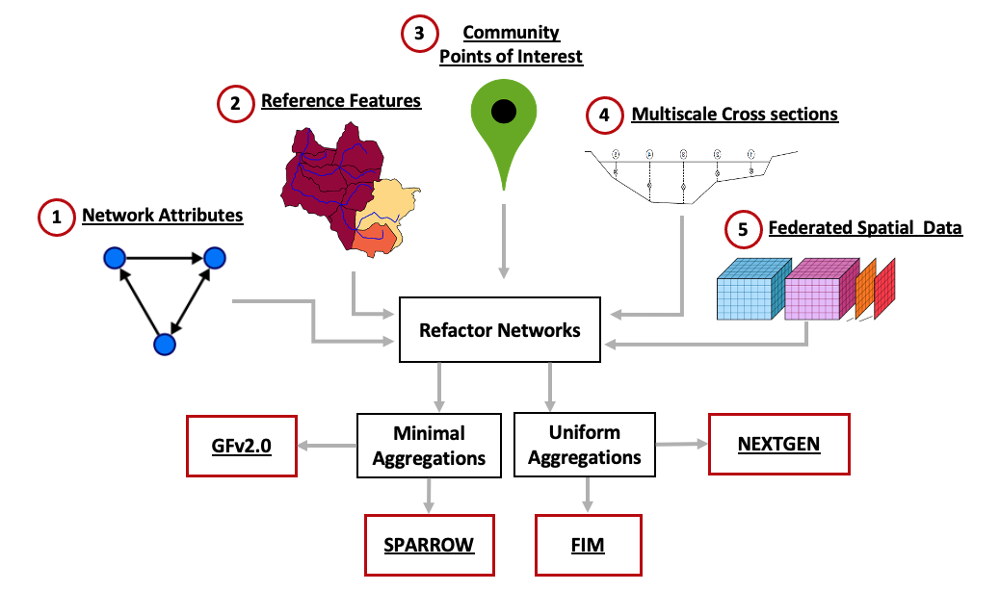
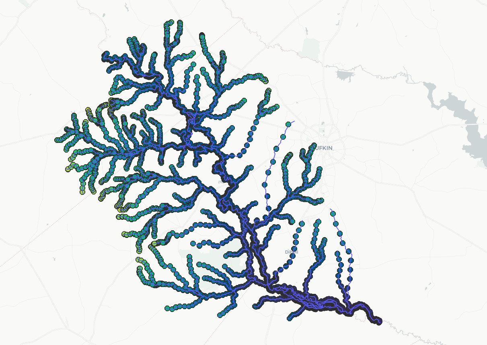
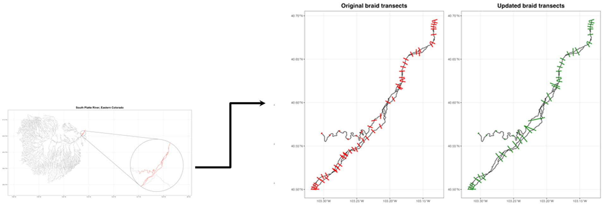

<!-- README.md is generated from README.Rmd. Please edit that file -->
```{r, include = FALSE}
options(width=100)
knitr::opts_chunk$set(
  collapse = TRUE,
  comment = "#>",
  fig.path = 'man/figures/',
  out.width = "100%",
  #warning = FALSE,
  message = TRUE
)
```

# hydrofabric3D

<!-- badges: start -->
[](https://github.com/mikejohnson51/hydrofabric3D/actions/workflows/R-CMD-check.yaml)
<!-- badges: end -->

The goal of hydrofabric3D is to generate DEM-based cross sections for hydrographic networks.

### Installation

You can install the development version of hydrofabric3D from [GitHub](https://github.com/) with:

``` r
# install.packages("devtools")
devtools::install_github("mikejohnson51/hydrofabric3D")
```

## Overview

This project develops a high resolution river channel/corridor data product based of [Reference Hydrofabric](https://noaa-owp.github.io/hydrofabric/articles/02-design-deep-dive.html) that support the modeling needs of NOAA and USGS. It is comprised of multiple modules that together form a clear picture of hydrofabric3D data model. This includes:

* Development of an automated tools to generate cross sections from a DEM
* Develop machine learning algorithms to predict river channel depth, width, and shape using ground observation 3.
* Estimate channel width using multi-source data and methods (e.g., remote sensing)

Schematic representation of the data model structure and how it is integrated into different products is shown bellow.

```{r, echo = FALSE}

```

This data model  data is provided through an R package that cuts cross-sections along rivers using 10m DEM and is informed with satellite, other products, and machine learning estimates of channel geometry (see [channel-shape-ML repo](https://github.com/NOAA-OWP/3d-hydrofabric/)).

## Data Model

The structure of the data model is based on the reference Hydrofabric Data Model and 

* Has the ability to represent a cross section transect and elevation
* Index knows and synthetic cross sections to a reference network
* Can be supplemented by HEC RAS, eHydro, Lidar

```{r, echo = FALSE}
knitr::include_graphics('man/figures/data_model2.png')
```

visit this [website](https://noaa-owp.github.io/hydrofabric/articles/cs_dm.html) for more updates.

## Cross Section 

The cross-section tool purpose is to generate DEM-based cross-sections (flood plains) for hydrographic networks and contains the estimates of bankfull channel cross section geometry and wherever there is HEC-RAS or Lidar data it incorporates them as well. 

An example of how these cross-sections look is shown below and a full description is available at [terrain_sliceR](https://github.com/mikejohnson51/terrain_sliceR)

<div style="display: flex; justify-content: center;">
  
</div>

OWP requires cross sections across the complete CONUS network to support hydrologic modeling and requisite flood mapping. We have automated this process and dealt with issues such as braided systems.

```{r, echo = FALSE}

```


Then we define and classify the cross section into left, right banks and in-channel as shown below. The problem is the flat line on the bottom of these plots, which represents the water level when this data was collected and nothing about the conditions at the time of collection (flood, dry year, etc.)

```{r, echo = FALSE}
knitr::include_graphics('man/figures/cs3.png')
```

More details about the proposed data model that follows Hyfeatures referencing and how tabular and spatial data are represented can be found [here](https://noaa-owp.github.io/hydrofabric/articles/cs_dm.html)

## Getting involved

List of contact information is outlined below:

J. Michael Johnson (mike.johnson@noaa.gov) for questions regarding hydrofabrics.

Angus Watters (angus.watters@noaa.gov) for questions regarding cross sections.

Dami Eyelade (dami.eyelade@noaa.gov) for questions regarding satellite derived products.

Arash Modaresi Rad (arash.rad@noaa.gov) for questions regarding machine learning models.


