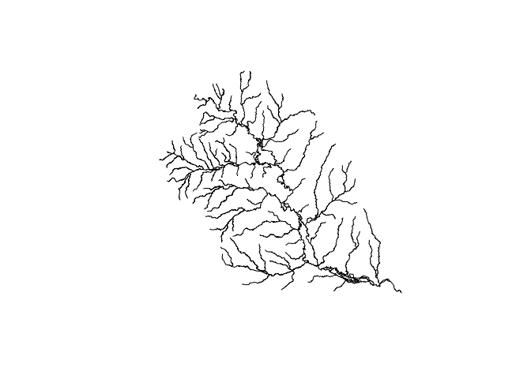
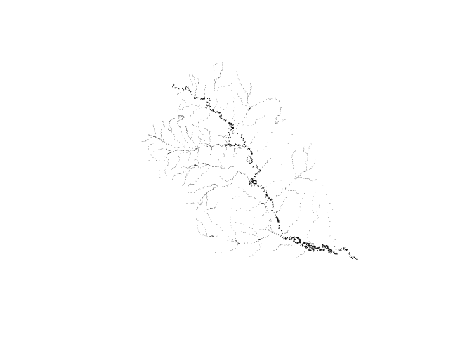
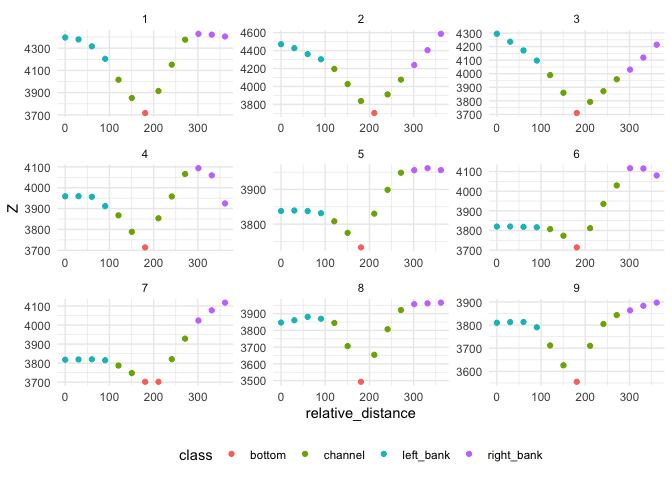

<!-- README.md is generated from README.Rmd. Please edit that file -->

# terrainSliceR

<!-- badges: start -->

[](https://github.com/mikejohnson51/terrain_sliceR/actions/workflows/R-CMD-check.yaml)
<!-- badges: end -->

The goal of terrainSliceR is to generate DEM-based cross sections for
hydrograhic networks.

## Installation

You can install the development version of terrainSliceR from
[GitHub](https://github.com/) with:

``` r
# install.packages("devtools")
devtools::install_github("mikejohnson51/terrain_sliceR")
```

# Example

This is a basic example which shows you how to cut cut cross sections
for a network.

## Define Network

``` r
library(terrainSliceR)
#> Using GDAL version 3.6.0 which was retracted because it cannot write large GPKG files
library(dplyr)
#> 
#> Attaching package: 'dplyr'
#> The following objects are masked from 'package:stats':
#> 
#>     filter, lag
#> The following objects are masked from 'package:base':
#> 
#>     intersect, setdiff, setequal, union

(net = linestring %>% 
  mutate(bf_width = exp(0.700    + 0.365* log(totdasqkm))))
#> Simple feature collection with 325 features and 5 fields
#> Geometry type: LINESTRING
#> Dimension:     XY
#> Bounding box:  xmin: 77487.09 ymin: 890726.5 xmax: 130307.4 ymax: 939129.8
#> Projected CRS: NAD83 / Conus Albers
#> # A tibble: 325 × 6
#>    nhdplus_comid                          geometry  comid totda…¹ dist_m bf_wi…²
#>  * <chr>                          <LINESTRING [m]>  <dbl>   <dbl>  <dbl>   <dbl>
#>  1 101           (128525.6 892408.3, 128565.7 892… 1.01e2 7.25e+3 3.25e3  51.7  
#>  2 24599575      (128084.7 892952.4, 128525.6 892… 2.46e7 7.25e+3 7.00e2  51.6  
#>  3 1078635       (127687.6 893270.4, 127799.7 893… 1.08e6 7.25e+3 5.22e2  51.6  
#>  4 1078637       (124942.8 893959.6, 124948.2 893… 1.08e6 6.82e+1 4.17e3   9.41 
#>  5 1078639       (125523.1 892528, 125657.3 89270… 1.08e6 7.18e+3 2.76e3  51.5  
#>  6 1078577       (123219.9 902292.8, 123233.5 902… 1.08e6 1.98e+1 9.91e3   5.99 
#>  7 1078575       (121975.5 909050.8, 122028.9 909… 1.08e6 4.13e+1 1.87e4   7.83 
#>  8 1078657       (124263.8 892410.4, 124420.6 892… 1.08e6 7.18e+3 1.66e3  51.5  
#>  9 1078663       (125628.9 892216, 125555.7 89220… 1.08e6 9.9 e-2 7.54e2   0.866
#> 10 1078643       (124248.1 892440.7, 124263.8 892… 1.08e6 7.18e+3 3.41e1  51.5  
#> # … with 315 more rows, and abbreviated variable names ¹​totdasqkm, ²​bf_width


plot(net$geometry)
```



## Cut cross sections

``` r
(transects = cut_cross_sections(net = net,
                         id = "comid", 
                         bf_widths = pmax(50, net$bf_width * 7),
                         num = 10) )
#> Simple feature collection with 2250 features and 4 fields
#> Geometry type: LINESTRING
#> Dimension:     XY
#> Bounding box:  xmin: 77510.14 ymin: 890557.3 xmax: 130371.3 ymax: 939089
#> Projected CRS: NAD83 / Conus Albers
#> # A tibble: 2,250 × 5
#>                                  geometry    hy_id bf_width cs_id lengthm
#>  *                       <LINESTRING [m]>    <dbl>    <dbl> <int>   <dbl>
#>  1   (128426.4 892244.6, 128705 892475.1)      101     362.     1    362.
#>  2 (128409.2 892093.2, 128767.5 892044.3)      101     362.     2    362.
#>  3 (128557.6 891564.6, 128896.1 891691.9)      101     362.     3    362.
#>  4   (128851.5 891197.9, 129153 891397.4)      101     362.     4    362.
#>  5     (129225.4 890883, 129345.8 891224)      101     362.     5    362.
#>  6 (129625.9 891067.1, 129390.2 891341.3)      101     362.     6    362.
#>  7 (129792.9 891147.7, 129656.7 891482.7)      101     362.     7    362.
#>  8 (129904.4 891131.2, 130211.5 890940.4)      101     362.     8    362.
#>  9 (130243.6 890557.3, 130371.3 890895.6)      101     362.     9    362.
#> 10 (128385.2 892294.5, 128666.1 892522.1) 24599575     362.     1    362.
#> # … with 2,240 more rows

plot(transects$geometry)
```



## Define Cross section points

``` r
(pts = cross_section_pts(transects, 
                        dem = '/Volumes/Transcend/ngen/DEM-products/dem.vrt'))
#> Simple feature collection with 23234 features and 8 fields
#> Geometry type: POINT
#> Dimension:     XY
#> Bounding box:  xmin: 77510.36 ymin: 890570.3 xmax: 130366.4 ymax: 939087.3
#> Projected CRS: NAD83 / Conus Albers
#> # A tibble: 23,234 × 9
#>    hy_id cs_id pt_id     Z lengthm relative_distance bf_width points_per_cs
#>    <dbl> <int> <int> <int>   <dbl>             <dbl>    <dbl>         <dbl>
#>  1   101     1     1  4396    362.               0       362.            13
#>  2   101     1     2  4422    362.              30.1     362.            13
#>  3   101     1     3  4318    362.              60.3     362.            13
#>  4   101     1     4  4209    362.              90.4     362.            13
#>  5   101     1     5  4086    362.             121.      362.            13
#>  6   101     1     6  3754    362.             151.      362.            13
#>  7   101     1     7  3717    362.             181.      362.            13
#>  8   101     1     8  3760    362.             211.      362.            13
#>  9   101     1     9  4268    362.             241.      362.            13
#> 10   101     1    10  4427    362.             271.      362.            13
#> # … with 23,224 more rows, and 1 more variable: geometry <POINT [m]>
```

## Classify Cross section points

``` r
(classified_pts = classify_points(pts))
#> Simple feature collection with 23234 features and 7 fields
#> Geometry type: POINT
#> Dimension:     XY
#> Bounding box:  xmin: 77510.36 ymin: 890570.3 xmax: 130366.4 ymax: 939087.3
#> Projected CRS: NAD83 / Conus Albers
#> # A tibble: 23,234 × 8
#>    hy_id cs_id pt_id     Z relative_di…¹ bf_wi…² class            geometry
#>    <dbl> <int> <int> <dbl>         <dbl>   <dbl> <chr>         <POINT [m]>
#>  1   101     1     1 4396            0      362. left… (128437.2 892253.4)
#>  2   101     1     2 4379.          30.1    362. left… (128458.6 892271.2)
#>  3   101     1     3 4316.          60.3    362. left…   (128480 892288.9)
#>  4   101     1     4 4204.          90.4    362. left… (128501.4 892306.6)
#>  5   101     1     5 4016.         121.     362. chan… (128522.9 892324.3)
#>  6   101     1     6 3852.         151.     362. chan… (128544.3 892342.1)
#>  7   101     1     7 3717          181.     362. bott… (128565.7 892359.8)
#>  8   101     1     8 3915          211.     362. chan… (128587.2 892377.5)
#>  9   101     1     9 4152.         241.     362. chan… (128608.6 892395.3)
#> 10   101     1    10 4376          271.     362. chan…     (128630 892413)
#> # … with 23,224 more rows, and abbreviated variable names ¹​relative_distance,
#> #   ²​bf_width
```

## Explore!

``` r
library(ggplot2)

ggplot(data = filter(classified_pts, hy_id == 101) ) + 
  geom_point(aes(x = relative_distance, y = Z, color = class)) + 
  facet_wrap(~cs_id, scales = "free") + 
  theme_minimal() + 
  theme(legend.position = "bottom")
```


