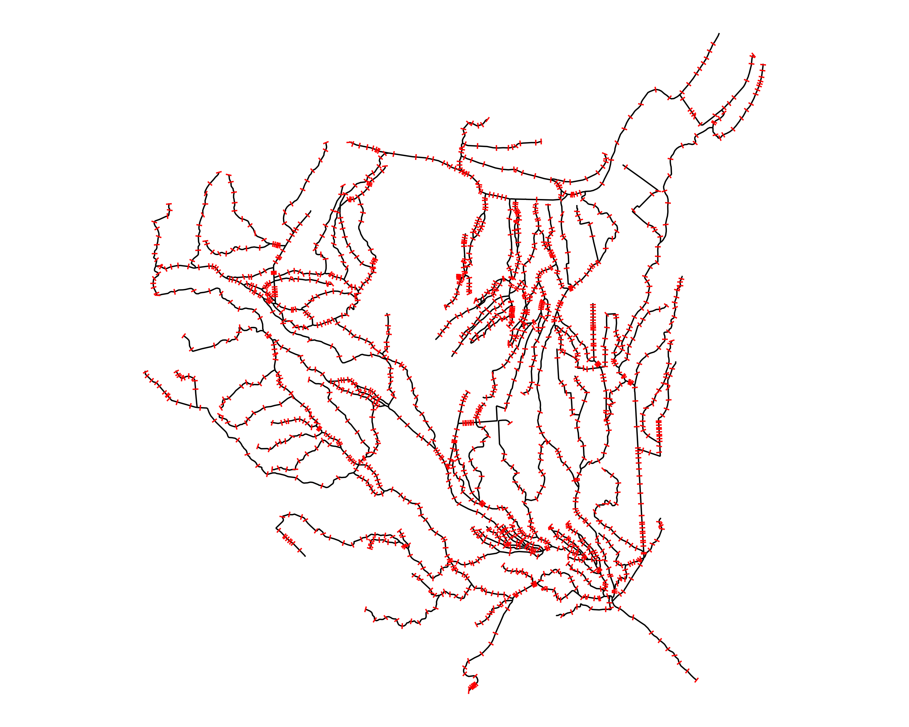
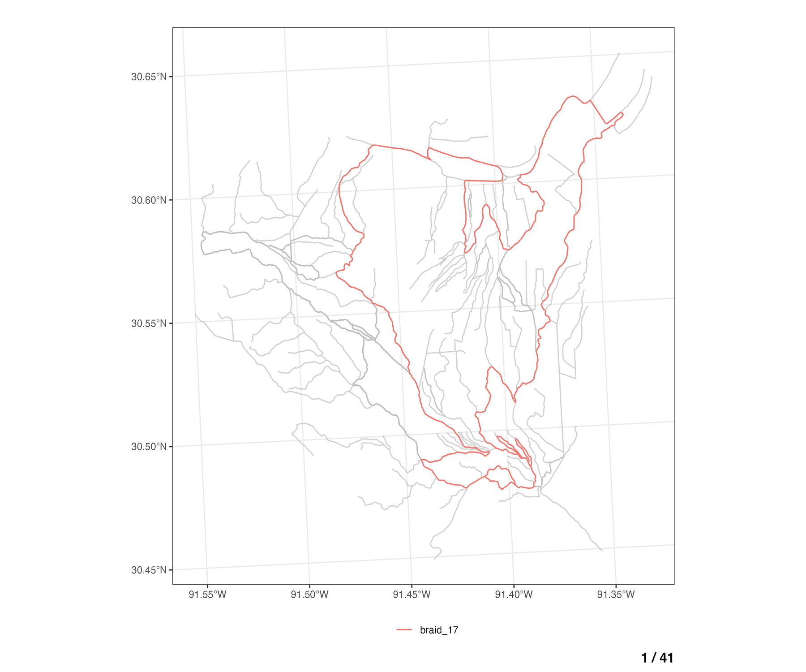
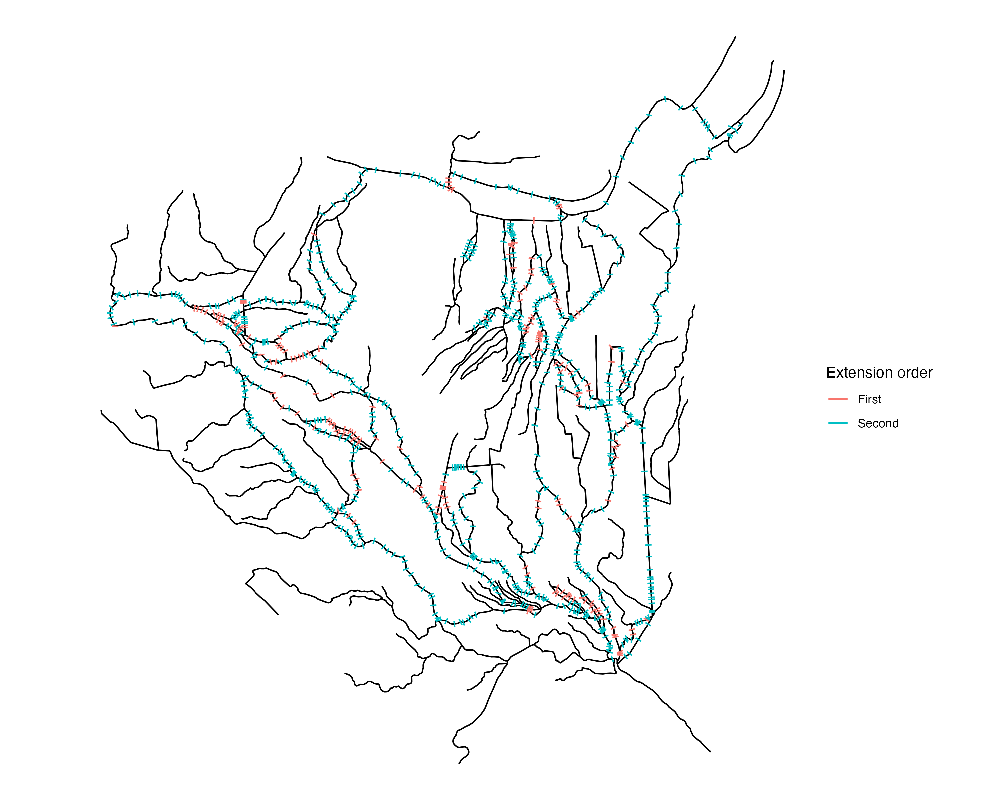
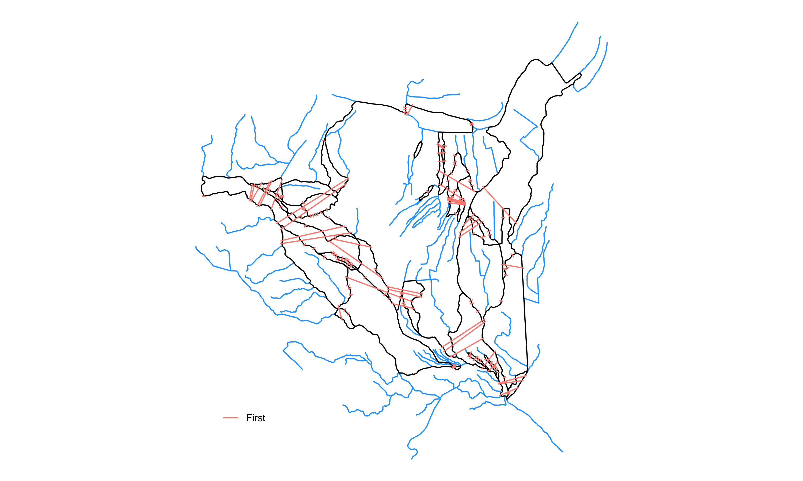
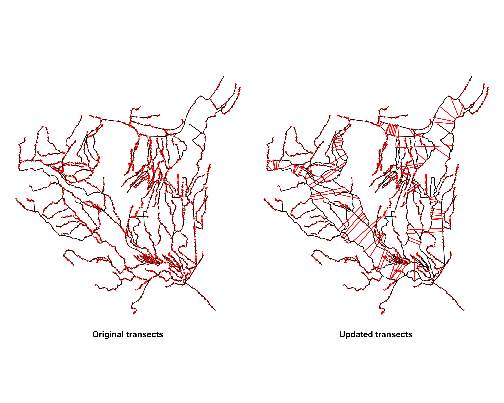

## Introduction
This vignette breaks down the methods used within `terrainSliceR` to cut cross sections across complex braided river networks. The following methods extend from the cross section cutting algorithms explained [here](../articles/cross_section_generator.html). 

```{r, include = FALSE}
knitr::opts_chunk$set(
  collapse = TRUE,
  comment = "#>"
)

library(bsplus)

thm <- ggplot2::theme_void() 
# "NOAA OWP Braided Cross Section Reparation"
```

```{r, eval = T, echo=F}
make_braids_gif <- function(network,
                            save_path  = NULL,
                            title = "",
                            height     = 8,
                            width      = 10,
                            gif_width  = 1800,
                            gif_height = 1500,
                            delay      = 0.8,
                            legend_pos = "bottom",
                            theme_obj  = NULL,
                            verbose    = FALSE
) {

  # if no save path is given
  if(is.null(save_path)) {
    # save path is current working directory
    save_path <- getwd()
  }


  ubraids <- unique(network$braid_id)

  # this will create a temp folder, but tempdir() won't let you name it:
  temp_dir <- tempdir()

  # this will create a folder within our temp folder, with a name of our choice:
  new_dir <- paste0(temp_dir, "/braid_plots/")

  # check if new temp dir alrteady exists
  if(dir.exists(new_dir)) {

    warning(new_dir, " already exists")

  }

  # create temporary directory
  dir.create(path = new_dir)

  if(verbose) { message("Plotting braids... ")}

  # make names lowercase
  names(network) <- tolower(names(network))

  # unique braid_ids
  ubraids <- unique(network$braid_id)

  ubraids <- ubraids[!grepl("no_braid", ubraids)]
  
  # set geometry name of network to "geometry"
  network <- nhdplusTools::rename_geometry(network, "geometry")
  
  for (i in 1:length(ubraids)) {

    if(verbose) {
      message(ubraids[i], " - (", i, "/", length(ubraids), ")")
    }

    braid_plot <-
      # b %>%
      network %>%
      # dplyr::select(comid, braid_id, geometry) %>%
      ggplot2::ggplot() +
      # ggplot2::geom_sf(ggplot2::aes(fill = braid_id)) +
      ggplot2::geom_sf(ggplot2::aes(color = braid_id)) +
      gghighlight::gghighlight(braid_id == ubraids[i]) +
      ggplot2::labs(
        title = title,
        caption = paste0(i, " / ", length(ubraids)),
        color = "",
        # caption = paste0("(", i, " / ", length(ubraids), ")")
      ) 
    
    if(is.null(theme_obj)) {
      braid_plot <- 
        braid_plot +
        ggplot2::theme_bw() +
        ggplot2::theme(
          plot.caption = ggplot2::element_text(size = 12, face = "bold"),
          legend.position = legend_pos
        )
    } else {
      braid_plot <- 
        braid_plot + 
        theme_obj +
        ggplot2::theme(
          plot.caption = ggplot2::element_text(size = 12, face = "bold"),
          legend.position = legend_pos
        )
    }

    temp_file <- tempfile(pattern =  paste0(ifelse(i < 10, paste0("0", i), i), "_braid"),
                          tmpdir = new_dir,
                          fileext = ".png"
    )

    # Generate a temporary file path
    ggplot2::ggsave(
      filename = temp_file,
      plot = braid_plot,
      height = height,
      width = width,
      scale = 1
    )


  }

  # save_path <- "D:/gif/braid_gif.gif"
  png_files <- sort(list.files(new_dir, full.names = TRUE))

  gifski::gifski(png_files,
                 gif_file = save_path,
                 width    = gif_width,
                 height   = gif_height,
                 delay    = delay
  )

  if(verbose) {
    message("Saving braid gif:\n --- ", save_path)
  }

  # unlink deletes temporary directory holding PNGs
  unlink(new_dir, recursive = TRUE)

}
```

```{r setup, warning=F, message = F}
library(terrainSliceR)
library(dplyr)
library(sf)
library(ggplot2)
library(nhdplusTools)
```

We begin with a testing set of braided flowlines located in Baton Rouge, LA. This area has a complex set of braids and highlights the need for rectifying cross section linestrings to better reflect the natural world. 

Starting from the COMID 18717056, we traverse upstream 30km and get a set of 303 flowlines.
```{r, eval = TRUE, echo= TRUE, warning=F, message = F}
# Heavily braided network in Baton Rouge, LA
net <- nhdplusTools::navigate_network(start = 18717056, mode = "UT",  distance_km = 30)

flood_plain_sections = 5

net <-
  net %>%
  # https://agupubs.onlinelibrary.wiley.com/doi/full/10.1002/2013WR013916
  dplyr::mutate(
    bf_width = exp(0.700	 + 0.365* log(totdasqkm)),
    cs_width = flood_plain_sections * bf_width
    ) %>% 
  dplyr::select(comid, divergence,bf_width, cs_width, lengthkm, totdasqkm, fromnode, tonode, terminalpa)

# set geometry name of network to "geometry"
net <- nhdplusTools::rename_geometry(net, "geometry")
```

```{r, eval = TRUE, echo = FALSE}

###### Code to remove to extra COMIDs that make this plot really messy if 
#        using COMID 101 as the starting COMID. If you remove these COMIDs (1078575, 1078577) 
#        when starting from COMID 101, the plots are alot easier to look at
#        filter out a flowline that makes plotting more difficult
net <- dplyr::filter(net, !comid %in% c(1078575, 1078577))

#### extra code to transform network to correct CRS 
net <- sf::st_transform(net, 5070) 
```

```{r, eval = F, echo = F}
#### CODE TO plot basic network
network_plot <- 
  ggplot2::ggplot() +
  ggplot2::geom_sf(data = net, color = "black") +
  thm

ggplot2::ggsave(
  filename = "../man/figures/network_plot.png",
  network_plot,
  height     = 8,
  width      = 10,
  scale = 1
)
```

<center>

</center>

<br>

Now let's add cross sections using the algorithm described [here](cross_section_generator.Rmd)

```{r, eval = T, echo = T, message=FALSE}
transects <- terrainSliceR::cut_cross_sections(
  net        = net,
  id         = "comid",
  cs_widths  = 200,
  num        = 10,
  fix_braids = FALSE,
  add        = TRUE
  )
```

```{r, eval = T, echo = F}
#### Code to transform transect lines to 5070
transects <- sf::st_transform(transects, 5070) 
```

```{r, eval = F, echo = F}
all_transects_plot <- 
  ggplot2::ggplot() +
  ggplot2::geom_sf(data = net, color = "black") + 
  ggplot2::geom_sf(data = transects, color = "red", alpha = 1) +
  thm

ggplot2::ggsave(
  filename = "../man/figures/all_transects_plot.png",
  all_transects_plot,
  height     = 8,
  width      = 10,
  scale = 1
)
```

<center>

</center>

<br>

Here we have created our cross sections lines with 10 transect lines per COMID/flowline geometry. The problem here is that this section of river is braided and we want to have cross sections extend across multiple flowlines in some cases such that the cross section line represents that width across the braided river sections, instead of having individual transect lines for each of the parallel braided flowlines. 

This presents a problem as braided systems are inherently complex and irregular. If we want to try and extend cross section lines across all flowlines in a given braid, the first thing we need is a way of uniquely identifying each braid and all of the flowlines within that braid. 

To accomplish this, we made use of the flowline `from/tonode` topology relationships, and implemented a Depth First Search (DFS) graph traversal algorithm on the flowline network. The DFS algorithm was implemented in such a way as to identify and return the set of COMIDs that make each individual closed loop braid in the network. 

## Locate braided flowlines

The `find_braids()` function can be used to identify and assign a `braid_id` to each flowline in a NHDPlus network dataset. The input network data must include a `comid`, `fromnode`, `tonode`, and `divergence` attributes. 
```{r, eval = T, echo = T}
# add braid_id column to network
braids <- terrainSliceR::find_braids(
    network     = net, 
    add         = TRUE,
    nested      = TRUE
  )
```

```{r, eval = F, echo = F}
# number of unique braids in the network
length(unique(braids$braid_id))
```

```{r, echo = FALSE, eval = FALSE}
plot_braids <- terrainSliceR::find_braids(
              network = net,
              nested  = FALSE,
              add     =  TRUE
            )
# plot_braids$braid_id %>% unique() %>% length()
# plot_braids %>% 
#   dplyr::rename(geometry = geom) %>% 
#   ggplot2::ggplot() +
#   ggplot2::geom_sf(ggplot2::aes(color = braid_id))+
#   gghighlight::gghighlight(braid_id == "braid_1")
make_braids_gif(
  network    = plot_braids,
  save_path  = "../man/figures/braid_vignette_gif.gif",
  title      = "",
  height     = 8,
  width      = 10,
  gif_width  = 1800,
  gif_height = 1500,
  delay      = 0.8,
  legend_pos = "bottom",
  theme_obj  = NULL,
  verbose    = FALSE
  )
# plot(plot_braids$geometry)
```

<center>

</center>

<br>

Now we have a method for identifying *which* flowlines are part of a braid and unique ID for each of the braids in the network. Next, we will find the cross section lines that are on these braided flowlines, and work on extending them to encompass the entire width of the river by crossing across the rest of the braided flowlines. 


First we want to join our transect lines with the sections of rivers with all flowlines that have a `braid_id` (flowlines that are NOT part of a braid have a `braid_id` of "no_braid")

So we seperate the braided flowlines from the non braided flowlines:
```{r, eval = T, echo = T}
# not braided flowlines
not_braids <-  dplyr::filter(braids, braid_id == "no_braid")

# trim down network to just the braided parts, and add a comid count to separate out multibraids
braids <- dplyr::filter(braids, braid_id != "no_braid") 

# add connected component "component_id" column
braids <- find_connected_components(braids)
```

```{r, eval = T, echo = F, message = F}
##### Code to threshold out largest braids

# terrainSliceR:::braid_lengths(braids)$braid_length
# tmp = braid_lengths(braids, multibraid = TRUE)
# braid_lengths(braids, multibraid = F)$braid_length

# braid_threshold = 100000
braid_threshold = 80000
# braid_threshold = 150000
# braid_threshold = 40000

# # # remove braids that have a total flowline length greater than braid_threshold
braids <- terrainSliceR:::braid_thresholder(
  x         = braids,
  originals = not_braids,
  threshold = braid_threshold,
  verbose   = TRUE
)

# remove braids that have a total flowline length greater than braid_threshold
# braids <- braid_thresholder3(
#   x         = braids, 
#   originals = not_braids, 
#   threshold = braid_threshold,
#   verbose   = TRUE
# )

# reassign braids and not_braids datasets to the updated values in 'braids' list (REASSIGNMENT ORDER MATTERS HERE)
not_braids <- braids$not_braids
braids     <- braids$braids
```

<br>

Then join the braided flowlines with the transects 
```{r, eval = T, echo = T}
cross_sections <- 
  transects %>%
  dplyr::filter(hy_id %in% braids$comid) %>%
  dplyr::left_join(
  sf::st_drop_geometry(
    dplyr::select(
      braids, comid, braid_id, is_multibraid
    )
  ),
  by = c("hy_id" = "comid")
  ) %>% 
  dplyr::arrange(-totdasqkm)
```

<br>

That gives us this set of all cross sections on braided flowlines:
```{r, eval = F, echo = F}
braid_xs_plot <- 
  ggplot2::ggplot() +
  ggplot2::geom_sf(data = net, color = "black") + 
  # ggplot2::geom_sf(data = braids, color = "dodgerblue", alpha = 1) +
  ggplot2::geom_sf(data = cross_sections, color = "red", alpha = 1) +
  thm

ggplot2::ggsave(
  filename = "../man/figures/braid_xs_plot.png",
  braid_xs_plot,
  height     = 8,
  width      = 10,
  scale = 1
)
```

<center>

</center>

<br>

We can now iterate over all of these cross sections and determine which cross sections should be extended, in what order, and by what distance.

```{r, eval = F, echo = F}
unique(cross_sections$braid_id)[1:3]
```

```{r, eval = F, echo = F}
# for(i in 1:nrow(cross_sections)) {
i = 115
i = 33
# i = 44
# i = 55
# i = 1222

# comid of transect line
com <- cross_sections$hy_id[i]

# braid ID of interest
braids_of_interest <- cross_sections$braid_id[i]
braids_of_interest

# # get the component ID of current COMID
comp_id <- braids$component_id[braids$comid == com]

# other geometries to cut across with transects
others <- terrainSliceR:::get_geoms_to_cut(
            x            = braids,
            id           = com,
            braid_id     = braids_of_interest,
            # component    = NULL,
            component    = comp_id,
            # method       = "neighbor"
            method       = "comid"
          )

plot(others$geometry)
```

<br>

## Identify flowlines to extend across

For each braided COMID, we want to take each of the cross sections lines on that COMID and try to extend these cross sections to cut across all of the other relevant braided flowlines in the area. The image below highlights for the "origin" COMID (blue), which other flowlines (red) are selected for the transect algorithm to try and cut across to generate an extended cross section geometry.
```{r, eval = F, echo = F}
# In the image below, the blue flowline is the COMID that we will be augmenting the transect lines for and the blue flowlines are the COMIDs that the transect extension algorithm will attempt to cut across. 
geoms_to_cut_plot <- 
  ggplot2::ggplot() +
  # ggplot2::geom_sf(data = net, color = "black") + 
    ggplot2::geom_sf(data = dplyr::bind_rows(
                              dplyr::mutate(
                                others,
                                grouping = "COMIDs to cross"
                                ),
                              dplyr::mutate(
                                dplyr::filter(braids, comid == com),
                                grouping = "Origin"
                                )
                              ), 
                     ggplot2::aes(color = grouping)) + 
  # ggplot2::geom_sf(data = dplyr::mutate(braids,
  #                       grouping = dplyr::case_when(
  #                         comid == com ~ "origin",
  #                         comid %in% others$comid ~ "geoms_to_cut",
  #                         TRUE ~ "other"
  #                       )), 
  #                     ggplot2::aes(color = grouping)) + 
  ggplot2::geom_sf(data = cross_sections[i, ], color = "black", alpha = 1) +
  ggplot2::labs(
    color = ""
  ) +
  thm

ggplot2::ggsave(
  filename = "../man/figures/geoms_to_cut_plot.png",
  geoms_to_cut_plot,
  height     = 8,
  width      = 10,
  scale = 1
)

```

<center>

</center>

<br>

```{r, eval = F, echo = F}
make_geoms_to_cut_gif <- function(
                            full_network,
                            braid_flowlines,
                            transect_lines,
                            cut_method = "comid",
                            one_transect_per = TRUE,
                            save_path  = NULL,
                            title = "",
                            height     = 8,
                            width      = 10,
                            gif_width  = 1800,
                            gif_height = 1500,
                            delay      = 0.5,
                            legend_pos = "bottom",
                            theme_obj  = NULL,
                            verbose    = FALSE
) {
  
  # full_network <- net
  # braid_flowlines <- braids
  # transect_lines <- cross_sections
  # save_path  = "../man/figures/geoms_to_cut_gif.gif"
 
  # if no save path is given
  if(is.null(save_path)) {
    # save path is current working directory
    save_path <- getwd()
  }


  # this will create a temp folder, but tempdir() won't let you name it:
  temp_dir <- tempdir()

  # this will create a folder within our temp folder, with a name of our choice:
  new_dir <- paste0(temp_dir, "/geoms_to_cut_plots/")

  # check if new temp dir alrteady exists
  if(dir.exists(new_dir)) {

    warning(new_dir, " already exists")

  }

  # create temporary directory
  dir.create(path = new_dir)

  if(verbose) { message("Plotting geometries to cut across... ")}

  # make names lowercase
  names(full_network) <- tolower(names(full_network))
  
  # set geometry name of network to "geometry"
  full_network <- nhdplusTools::rename_geometry(full_network, "geometry")

  # if missing connected component "component_id" column, try to add it
  if(!"component_id" %in% names(braid_flowlines)) {
     # add connected component "component_id" column
    braid_flowlines <- find_connected_components(braid_flowlines)
  }
  
  # if only one transect plot should be created per COMID
  if(one_transect_per) {
    transect_lines <- 
      transect_lines %>% 
      dplyr::group_by(hy_id) %>% 
      dplyr::slice(1) %>% 
      dplyr::ungroup()
  }
  
  for (i in 1:nrow(transect_lines)) {

    if(verbose) {
      message(i, "/", nrow(transect_lines))
    }
    
    # comid of transect line
    com <- transect_lines$hy_id[i]
    
    # braid ID of interest
    braids_of_interest <- transect_lines$braid_id[i]
    
    # # get the component ID of current COMID
    comp_id <- braid_flowlines$component_id[braid_flowlines$comid == com]
    
    # other geometries to cut across with transects
    others <- terrainSliceR:::get_geoms_to_cut(
                x            = braid_flowlines,
                id           = com,
                braid_id     = braids_of_interest,
                component    = comp_id,
                # method       = "neighbor"
                method       = cut_method
              )
    
     braid_flowlines_plot <-
        ggplot2::ggplot() +
        ggplot2::geom_sf(data = full_network, color = "black") + 
        ggplot2::geom_sf(data = dplyr::bind_rows(
                              dplyr::mutate(
                                others,
                                grouping = "Geoms to cut"
                                ),
                              dplyr::mutate(
                                dplyr::filter(braid_flowlines, comid == com),
                                grouping = "Origin"
                                )
                              ), 
                     ggplot2::aes(color = grouping)) + 
        # ggplot2::geom_sf(data = dplyr::mutate(braid_flowlines,
        #                                         grouping = dplyr::case_when(
        #                                           comid == com ~ "Origin COMID",
        #                                           TRUE ~ "COMIDs to cut across"
        #                                           )
        #                                         ), 
        #                             ggplot2::aes(color = grouping)
        #                                          ) + 
        ggplot2::geom_sf(
          data = sf::st_centroid(transect_lines[i, ]),# data = transect_lines$geometry[i],
          color = "black",
          size = 2, # size = 3,
          # shape = 9,# shape = 4,# shape = 8, # shape = 26, # shape = 15, # shape= 13,
          alpha = 1
        ) +
        ggplot2::labs(
          title = title,
          color = "",
          caption = paste0(i, " / ", nrow(transect_lines))
        ) 

    if(is.null(theme_obj)) {
      braid_flowlines_plot <- 
        braid_flowlines_plot +
        ggplot2::theme_bw() +
        ggplot2::theme(
          plot.caption = ggplot2::element_text(size = 12, face = "bold"),
          # plot.caption = ggplot2::element_text(size = 12, hjust = 0.5, face = "bold"),
          legend.position = legend_pos,
          legend.direction = "vertical"
        )
    } else {
      braid_flowlines_plot <- 
        braid_flowlines_plot + 
        theme_obj +
        ggplot2::theme(
          plot.caption = ggplot2::element_text(size = 12, face = "bold"),
          # plot.caption = ggplot2::element_text(size = 12, hjust = 0.5, face = "bold"),
          legend.position = legend_pos,
          legend.direction = "vertical"
        )
    }

    temp_file <- tempfile(pattern =  paste0(ifelse(i < 10, paste0("0", i), i), "_braid_flowlines"),
                          tmpdir = new_dir,
                          fileext = ".png"
    )

    # Generate a temporary file path
    ggplot2::ggsave(
      filename = temp_file,
      plot = braid_flowlines_plot,
      height = height,
      width = width,
      scale = 1
    )


  }

  # save_path <- "D:/gif/braid_gif.gif"
  png_files <- sort(list.files(new_dir, full.names = TRUE))

  # sort file paths based on the extracted numbers
  plot_order <- as.numeric(gsub('.*geoms_to_cut_plots//(\\d+)_braid_flowlines.*', '\\1', png_files))
  # plot_order <- as.numeric(stringr::str_extract(png_files, "(?<=geoms_to_cut_plots//)(\\d+)(?=_braid_flowlines)"))
  
  png_files <- png_files[order(plot_order)]
  
  gifski::gifski(png_files,
                 gif_file = save_path,
                 width    = gif_width,
                 height   = gif_height,
                 delay    = delay
  )

  if(verbose) {
    message("Saving flowlines to cut gif:\n --- ", save_path)
  }

  # unlink deletes temporary directory holding PNGs
  unlink(new_dir, recursive = TRUE)

}
```
```{r, eval = F, echo = F}
make_geoms_to_cut_gif(
  full_network    = net,
  braid_flowlines = braids,
  transect_lines = cross_sections,
  cut_method = "comid",
  one_transect_per = TRUE,
  save_path  = "../man/figures/geoms_to_cut_gif.gif",
  title      = "",
  height     = 8,
  width      = 10,
  gif_width  = 1800,
  gif_height = 1500,
  delay      = 1.2,
  legend_pos = "bottom",
  theme_obj  = NULL,
  verbose    = FALSE
  )
```

To see this for all braided flowlines in the network, the animation below walks through each COMID of the braided flowlines (blue), and shows which of the remaining other braided flowlines are eligible to be cut across from the any of the cross sections lines on the "origin" COMID (blue).

<center>

</center>

<br>

If we look at an individual COMID in a given braid, and we decide we want to extend our cross sections for that COMID outward to try and cut across other flowlines within the same braided system, we now have a method for selecting which **other** COMIDs are candidates for the extended line to cut across. 

If we didn't come up with a way of distinguishing which flowlines our extended transect lines were allowed to cross over, then our algorithm would ultimately try and extend each transect out indefinitely/attempt to cut across ALL other flowlines in the network. This wouldn't make hydrologic or computational sense.

```{r, eval = F, echo = F}

line_position_plots <- function(theme_obj = NULL) {
  
  if(is.null(theme_obj)) {
    theme_obj <- ggplot2::theme_void()
    
  }
  ####### ODD MIDDLE - HIGHLIGHT MIDDLE 1
  lines_df <- data.frame(
    line_id = 1:5,
    x = rep(1:5, each = 2)
  ) %>% 
    dplyr::arrange(line_id) %>% 
    dplyr::mutate(
      x = line_id,
      y = rep(c(1,4), 5)
    )
  
  # Create an sf data frame
  lines_sf <-
    lines_df %>% 
    sf::st_as_sf(coords = c("x", "y")) %>% 
    dplyr::group_by(line_id) %>% 
    dplyr::summarise() %>% 
    sf::st_cast("LINESTRING")
  
  # plot parallel lines 
  odd_middle_plot <- 
    ggplot2::ggplot() +
    ggplot2::geom_sf(data = dplyr::mutate(
      lines_sf, 
      position = dplyr::case_when(
        line_id == 3 ~ "Middle",
        TRUE ~ "Not middle"
      )
    ), 
    ggplot2::aes(color = position), 
    size = 1
    ) +
    ggplot2::scale_color_manual(values = c("coral", "black")) +
    ggplot2::labs(
      # title = "Inner flowlines (even case)",
      color = "",
      caption = "Inner (odd case)"
      ) +
    theme_obj +
    ggplot2::theme(
      plot.title = ggplot2::element_text(size = 12, face = "bold", hjust = 0.5),
      plot.caption = ggplot2::element_text(size = 12, face = "bold", hjust = 0.5),
           axis.text = ggplot2::element_blank(),
      # legend.position = "right"
      # legend.position = "bottom"
      legend.position = "none"
    )
  
  
  ####### EVEN MIDDLE - HIGHLIGHT MIDDLE 2
  lines_df <- data.frame(
    line_id = 1:6,
    x = rep(1:6, each = 2)
  ) %>% 
    dplyr::arrange(line_id) %>% 
    dplyr::mutate(
      x = line_id,
      y = rep(c(1,4), 6)
    )
  
  # make sf data frame
  lines_sf <- 
    lines_df %>% 
    sf::st_as_sf(coords = c("x", "y")) %>% 
    dplyr::group_by(line_id) %>% 
    dplyr::summarise() %>% 
    sf::st_cast("LINESTRING")

 # plot parallel lines 
  even_middle_plot <- 
    ggplot2::ggplot() +
      # ggplot2::geom_sf(data = lines_sf, size = 1) +
    ggplot2::geom_sf(data = dplyr::mutate(
      lines_sf,
      position = dplyr::case_when(
        line_id %in% c(3, 4) ~ "Middle",
        TRUE ~ "Not middle"
      )
    ),
    ggplot2::aes(color = position),
    size = 1
    ) +
    ggplot2::scale_color_manual(values = c("coral", "black")) +
    ggplot2::labs(
      # title = "Inner flowlines (even case)",
      color = "",
      caption = "Inner (even case)"
      ) +
    theme_obj +
    ggplot2::theme(
      plot.title = ggplot2::element_text(size = 12, face = "bold", hjust = 0.5),
      plot.caption = ggplot2::element_text(size = 12, face = "bold", hjust = 0.5),
           axis.text = ggplot2::element_blank(),
       # legend.position = "right"
      # legend.position = "bottom"
      legend.position = "none"
    )
  
  ####### OUTER SINGLE PLOT
  # OUTER SINGLE LINESTRINGS - HIGHLIGHT BOTH
  lines_df <- data.frame(
    line_id = 1:2,
    x = rep(1:2, each = 2)
    # y = c(1, 4, 1, 4, 1, 4, 1, 4, 1, 4)
  ) %>% 
    dplyr::arrange(line_id) %>% 
    dplyr::mutate(
      x = line_id,
      y = rep(c(1,4), 2)
    )
  
  # Create an sf data frame
  lines_sf <- 
    lines_df %>% 
    sf::st_as_sf(coords = c("x", "y")) %>% 
    dplyr::group_by(line_id) %>% 
    dplyr::summarise() %>% 
    sf::st_cast("LINESTRING")

  # plot parallel lines 
  outer_single_plot <-
    ggplot2::ggplot() +
    # ggplot2::geom_sf(data = lines_sf, size = 1) +
    ggplot2::geom_sf(data = dplyr::mutate(
      lines_sf,
      position = dplyr::case_when(
        line_id %in% c(1, 2) ~ "Outer single",
        TRUE ~ "Other"
      )
    ),
    ggplot2::aes(color = position),
    size = 1
    ) +
    ggplot2::scale_color_manual(values = c("coral")) +
    ggplot2::labs(
      # title = "Inner flowlines (even case)",
      color = "",
      caption = "Outer single"
      ) +
    theme_obj +
    ggplot2::theme(
      plot.title = ggplot2::element_text(size = 12, face = "bold", hjust = 0.5),
      plot.caption = ggplot2::element_text(size = 12, face = "bold", hjust = 0.5),
           axis.text = ggplot2::element_blank(),
      # legend.position = "bottom"
      legend.position = "none"
    )
  
  
  ####### OUTER MULTIPLES
  # Create a simple data frame with 5 parallel vertical lines
  lines_df <- data.frame(
    line_id = 1:6,
    x = rep(1:6, each = 2)
    # y = c(1, 4, 1, 4, 1, 4, 1, 4, 1, 4)
  ) %>% 
    dplyr::arrange(line_id) %>% 
    dplyr::mutate(
      x = line_id,
      y = rep(c(1,4), 6)
    )
  
  # Create an sf data frame
  lines_sf <- 
    lines_df %>% 
    sf::st_as_sf(coords = c("x", "y")) %>% 
    dplyr::group_by(line_id) %>% 
    dplyr::summarise() %>% 
    sf::st_cast("LINESTRING")
    
 # plot parallel lines 
  outer_multis_plot <-
    ggplot2::ggplot() +
      ggplot2::geom_sf(data = lines_sf, size = 1) +
    ggplot2::geom_sf(data = dplyr::mutate(
      lines_sf,
      position = dplyr::case_when(
        line_id %in% c(1, 6) ~ "Outer multiples",
        TRUE ~ "Not Outer multiples"
      )
    ),
    ggplot2::aes(color = position),
    size = 1
    ) +
    ggplot2::scale_color_manual(values = c("black", "coral")) +
    ggplot2::labs(
      # title = "Inner flowlines (even case)",
      color = "",
      caption = "Outer multiples"
      ) +
    theme_obj +
    ggplot2::theme(
      plot.title = ggplot2::element_text(size = 12, face = "bold", hjust = 0.5),
      plot.caption = ggplot2::element_text(size = 12, face = "bold", hjust = 0.5),
           axis.text = ggplot2::element_blank(),
       # legend.position = "right"
      # legend.position = "bottom"
      legend.position = "none"
    )
  
  ####### IN BETWEEN, not middle, not outer single/multi, not "no_intersections
  # Create a simple data frame with 5 parallel vertical lines
  lines_df <- data.frame(
    line_id = 1:8,
    x = rep(1:8, each = 2)
  ) %>% 
    dplyr::arrange(line_id) %>% 
    dplyr::mutate(
      x = line_id,
      y = rep(c(1,4), 8)
    )
  
  # make sf data frame
  lines_sf <- 
    lines_df %>% 
    sf::st_as_sf(coords = c("x", "y")) %>% 
    dplyr::group_by(line_id) %>% 
    dplyr::summarise() %>% 
    sf::st_cast("LINESTRING")
  
  # # plot parallel lines 
  in_between_plot <-
    ggplot2::ggplot() +
      # ggplot2::geom_sf(data = lines_sf, size = 1) +
    ggplot2::geom_sf(data = dplyr::mutate(
      lines_sf,
      position = dplyr::case_when(
        line_id %in% c(2, 3, 6, 7) ~ "In between",
        TRUE ~ "Not In between"
      )
    ),
    ggplot2::aes(color = position),
    size = 1
    ) +
    ggplot2::scale_color_manual(values = c("coral", "black")) +
    ggplot2::labs(
      # title = "Inner flowlines (even case)",
      color = "",
      caption = "In between"
      ) +
    theme_obj +
    ggplot2::theme(
      plot.title = ggplot2::element_text(size = 12, face = "bold", hjust = 0.5),
      plot.caption = ggplot2::element_text(size = 12, face = "bold", hjust = 0.5),
      axis.text = ggplot2::element_blank(),
       # legend.position = "right"
      # legend.position = "bottom"
      legend.position = "none"
    )
  
  plot_list <- list("odd_middle" = odd_middle_plot,
                   "even_middle" = even_middle_plot,
                   "outer_single" = outer_single_plot, 
                   "outer_multi" = outer_multis_plot,
                   "in_between" = in_between_plot
                   )
  
  return(plot_list)
}

# position_plots <- line_position_plots(theme_obj = ggplot2::theme_bw())
position_plots <- line_position_plots(theme_obj = ggplot2::theme_void())
# position_plots %>% length()
position_plots
# library(patchwork)
# position_plots$in_between

# all_positions <- (
#   (position_plots[["odd_middle"]] + position_plots[["even_middle"]])
#   /
#     (position_plots[["outer_single"]] + position_plots[["outer_multi"]])
#   )/position_plots[["in_between"]]
# all_positions <- (
#   (position_plots[["odd_middle"]] + position_plots[["even_middle"]] + position_plots[["in_between"]])
#   /
#     (position_plots[["outer_single"]] + position_plots[["outer_multi"]])
#   )
# 
# ggplot2::ggsave(
#   filename = "../man/figures/all_position_plots.png",
#   all_positions,
#   height     = 6,
#   width      = 20,
#   scale = 1
# )

ggplot2::ggsave(
  filename = "../man/figures/odd_middle.png",
  position_plots[["odd_middle"]] ,
  height     = 6,
  width      = 10,
  scale = 1
)

ggplot2::ggsave(
  filename = "../man/figures/even_middle.png",
  position_plots[["even_middle"]] ,
  height     = 6,
  width      = 10,
  scale = 1
)
ggplot2::ggsave(
  filename = "../man/figures/in_between.png",
  position_plots[["in_between"]] ,
  height     = 6,
  width      = 10,
  scale = 1
)
ggplot2::ggsave(
  filename = "../man/figures/outer_single.png",
  position_plots[["outer_single"]] ,
  height     = 6,
  width      = 10,
  scale = 1
)

ggplot2::ggsave(
  filename = "../man/figures/outer_multi.png",
  position_plots[["outer_multi"]] ,
  height     = 6,
  width      = 10,
  scale = 1
)

position_paths <- c(
  "../man/figures/odd_middle.png",
  "../man/figures/even_middle.png",
  "../man/figures/in_between.png",
  "../man/figures/outer_single.png",
  "../man/figures/outer_multi.png"
  )
```

<br>

## Order of extensions
When ever we take a transect line and extend it outward in either direction, we run into the possibility that our newly extended transect line will now violate one of the fundemental properties of our cross sections:

1. The extended transect line now intersects with *another flowline outside of the braided area*
2. The extended transect line now intersects with *another transect line*
3. The extended transect line now intersects with *its own COMID/flowline*

Moreover, some flowlines in a braided system should be given priority over other flowlines when it comes to the order that their transects are extended.
Transect lines in the **middle** of a braided system should be extended first as they are likely to produce the most representative transect line, so we want to prioritize extending these first.

Determining the middle flowline in a braided system was a challenge. In some cases, the mainstem flowline is the middle flowline within a braid, but in some cases this isn't the case. We found a solution that relies on the number of intersections a flowlines transect line has when it is extended in either direction. From each transect line, we can count the number of intersections on either side of the transect when we extend the transect line out as far as needed to cross all neighboring flowlines. 

Using this technique we classified each cross section line into 5 different catagories according to its relative position within the braided system:

1. **No intersection:** transect line never intersects another flowline after maximum extension in both directions

2. **Outer single:** Transect line will intersect zero flowlines in one direction, and exactly one other flowline in the other direction, this is the case when a braid has just 2 parts.

3. **Outer multiple:** Transect line will intersect zero flowlines in one direction, and more than one other flowline in the other direction

4. **Inner:** Transect line is in the middle of a braid. There are 2 scenarios, either there is an *even* or an *odd* number of parallel flowlines in the braid:

- **Odd case:** Same number of intersections in both directions

\[
intersects\_count_1 == intersects\_count_2
\]

- **Even case:** the maximum number of counted intersections minus one equals the minimum number of counted intersections
 
\[
\max(intersects\_count_1, intersects\_count_2) - 1 == \min(intersects\_count_1, intersects\_count_2)
\]


5. **In between** - Transect line is between the middle and the outer portion of the braid

<br>

These relationships are shown using a simple set of parallel lines meant to represent flowlines in a braid. The red  line in the image set below highlights the specific line(s) that fall into the given classification.
```{r, eval = T, echo = F}
position_paths <- c("../man/figures/odd_middle.png",
"../man/figures/even_middle.png",
"../man/figures/in_between.png",
"../man/figures/outer_single.png",
"../man/figures/outer_multi.png")

# # position_plots[["odd_middle"]] / position_plots[["even_middle"]]
# bsplus::bs_carousel(id = "positions_within_braids") %>%
#   bsplus::bs_set_data(interval = FALSE) %>%
#   bsplus::bs_append(content = bsplus::bs_carousel_image(src = position_paths[1])) %>%
#   bsplus::bs_append(content = bsplus::bs_carousel_image(src = position_paths[2])) %>% 
#   bsplus::bs_append(content = bsplus::bs_carousel_image(src = position_paths[3])) %>%
#   bsplus::bs_append(content = bsplus::bs_carousel_image(src = position_paths[4])) %>%
#   bsplus::bs_append(content = bsplus::bs_carousel_image(src = position_paths[5]))

# Accordion instead of carousel
bsplus::bs_accordion(id = "positions_within_braids_accordion") %>%
  bsplus::bs_append(title = "Inner (odd case)", content = bsplus::bs_carousel_image(src = position_paths[1])) %>%
  bsplus::bs_append(title = "Inner (even case)", content = bsplus::bs_carousel_image(src = position_paths[2])) %>%
  bsplus::bs_append(title = "In between", content = bsplus::bs_carousel_image(src = position_paths[3])) %>%
  bsplus::bs_append(title = "Outer single", content = bsplus::bs_carousel_image(src = position_paths[4])) %>%
  bsplus::bs_append(title = "Outer multiple", content = bsplus::bs_carousel_image(src = position_paths[5]))
```

```{r, eval = F, echo = F}
tmp_xs <- cross_sections
# column to fill out relative position of cross section
tmp_xs$position <- NA

for(i in 1:nrow(tmp_xs)) {

  # comid of transect line
  com <- tmp_xs$hy_id[i]
  
  # braid ID of interest
  braids_of_interest <- tmp_xs$braid_id[i]
  # braids_of_interest
  
  # # get the component ID of current COMID
  comp_id <- braids$component_id[braids$comid == com]
  
  # other geometries to cut across with transects
  others <- terrainSliceR:::get_geoms_to_cut(
              x            = braids,
              id           = com,
              braid_id     = braids_of_interest,
              # component    = NULL,
              component    = comp_id,
              # method       = "neighbor"
              method       = "comid"
            )
  
    # geoms_to_cut  = others
  extend_maps <- terrainSliceR:::geos_augment_transect(
      cross_section = tmp_xs[i, ],
      geoms_to_cut  = geos::as_geos_geometry(others$geometry),
      geom_ids      = others$comid,
      max_distance  = NULL, 
      by            = 1, 
      as_df         = FALSE,
      carry_geom    = FALSE
    )
    
    # extend_maps$head$as_list()
    position <- extend_maps$head$get("position")
    
    tmp_xs$position[i] <- position
    
}

pre_extension_order_plot <- 
  ggplot2::ggplot() +
  ggplot2::geom_sf(data = net, color = "black") +
  ggplot2::geom_sf(
    data = dplyr::mutate(
                      tmp_xs,
                      is_inner = dplyr::case_when(
                      position == "inner" ~ "First",
                      TRUE                ~ "Second"
                        )
                    ),
                   ggplot2::aes(color = is_inner)) +
  # ggplot2::geom_sf(data = tmp_xs, ggplot2::aes(color = position)) +
  ggplot2::labs(
    color = "Extension order"
    # color = "Relative postion"
  ) +
  thm +
  ggplot2::theme(
      plot.caption = ggplot2::element_text(size = 12, face = "bold"),
      # plot.caption = ggplot2::element_text(size = 12, hjust = 0.5, face = "bold"),
      legend.position = "right",
      legend.direction = "vertical"
    )

ggplot2::ggsave(
  filename = "../man/figures/pre_extension_order_plot.png",
  pre_extension_order_plot,
  height     = 8,
  width      = 10,
  scale = 1
)
```

<br>

In order to get the best set of final transect lines, we prioritize the "inner" transect lines and work on extending these ones first. 

<center>

</center>

<br>

```{r, eval = F, echo = F}
# library(fastmap)
xs <- cross_sections

# keep track of all original crossections
all_xs <- paste0(xs$hy_id, "_", xs$cs_id)

# column to store the relative position within the braid of the flowline we're on 
xs$relative_position <- NA

# flag determining whether transect should/has been replaced
xs$changed <- FALSE

# flag determining whether transect is to be processed in a future step after middle flowlines are processed
xs$pending <- TRUE

# flag determining whether transect is to be processed in a future step after middle flowlines are processed
xs$pending <- TRUE

# empty columns to store number of head/tail intersections
xs$head_cuts     <- NA
xs$tail_cuts     <- NA

# empty columns to store distance needed to extend from head/tail of line
xs$head_distance <- NA
xs$tail_distance <- NA

for(i in 1:nrow(xs)) {
    # message("i: ", i, "/", nrow(xs))
    # i = 1

    # comid of transect line
    com <- xs$hy_id[i]
    
    # braid ID of interest
    bid <- xs$braid_id[i]
    
    # get the component ID of current COMID
    comp_id <- braids$component_id[braids$comid == com]
  
    # other geometries to cut across with transects
    others <- terrainSliceR:::get_geoms_to_cut(
                x            = braids,
                id           = com,
                braid_id     = bid,
                component    = comp_id,
                method       = "comid"
              )
    
    # aug_time1 <- Sys.time()

    # geoms_to_cut  = others
    extend_maps <- terrainSliceR:::geos_augment_transect(
      cross_section = xs[i, ],
      geoms_to_cut  = geos::as_geos_geometry(others$geometry),
      geom_ids      = others$comid,
      max_distance  = NULL, 
      by            = 1, 
      as_df         = FALSE,
      carry_geom    = FALSE
    )
    
    position <- extend_maps$head$get("position")
    
    # if a flowline on the inner portion of a braid, make extension and insert
    if(position == "inner") {
      
      # extend line out by total distance key values in head and tail maps
      res_geom <- terrainSliceR:::geos_extend_transects(
        starter_line   = geos::as_geos_geometry(xs$geometry[i]),
        head_distance  = extend_maps$head$get("total_distance"),
        tail_distance  = extend_maps$tail$get("total_distance"),
        extra_distance = xs$cs_widths[i]/2
      )
      # ONLY UPDATE geometry if it does NOT intersect with any of the other multibraid transects that have been changed so far (AND LEAVE OUT SELF)
      if(
        !geos::geos_intersects_any(
          res_geom,
          geos::as_geos_geometry(dplyr::filter(xs[-i,], changed))
        )
      )  
        {
        
        # updatem geometry with new, extended cross section
        xs$geometry[i] <- sf::st_geometry(
          sf::st_as_sf(res_geom)
        )
        
        # flag determining whether transect should be replaced
        xs$changed[i] <- TRUE
        
      }
      
    } 
    
    # update relative position column
    xs$relative_position[i] <- extend_maps$head$get("position")
    
    # UPDATE "pending" value to reflect that this is a inner flowline and it should be processed at once
    xs$pending[i] <- extend_maps$head$get("pending")
    
    # update head/tail distances values in dataframe w/ values from head/tail hashmaps
    xs$head_distance[i] <- extend_maps$head$get("total_distance")
    xs$tail_distance[i] <- extend_maps$tail$get("total_distance")
    
    # update head_cuts/tail_cuts counts (intersection counts) values dataframe w/ values from head/tail hashmaps
    xs$head_cuts[i] <- extend_maps$head$get("count")
    xs$tail_cuts[i] <- extend_maps$tail$get("count")
   
  }
```

```{r, eval = F, echo= F}
process_inner_xs <- function(xs, b) {
  # keep track of all original crossections
  all_xs <- paste0(xs$hy_id, "_", xs$cs_id)
  
  # column to store the relative position within the braid of the flowline we're on 
  xs$relative_position <- NA
  
  # flag determining whether transect should/has been replaced
  xs$changed <- FALSE
  
  # flag determining whether transect is to be processed in a future step after middle flowlines are processed
  xs$pending <- TRUE
  
  # flag determining whether transect is to be processed in a future step after middle flowlines are processed
  xs$pending <- TRUE
  
  # empty columns to store number of head/tail intersections
  xs$head_cuts     <- NA
  xs$tail_cuts     <- NA
  
  # empty columns to store distance needed to extend from head/tail of line
  xs$head_distance <- NA
  xs$tail_distance <- NA
  
  for(i in 1:nrow(xs)) {
    # message("i: ", i, "/", nrow(xs))
    # i = 1

    # comid of transect line
    com <- xs$hy_id[i]
    
    # braid ID of interest
    bid <- xs$braid_id[i]
    
    # get the component ID of current COMID
    comp_id <- b$component_id[b$comid == com]
  
    # other geometries to cut across with transects
    others <- terrainSliceR:::get_geoms_to_cut(
                x            = b,
                id           = com,
                braid_id     = bid,
                component    = comp_id,
                method       = "comid"
              )
    
    # aug_time1 <- Sys.time()

    # geoms_to_cut  = others
    extend_maps <- terrainSliceR:::geos_augment_transect(
      cross_section = xs[i, ],
      geoms_to_cut  = geos::as_geos_geometry(others$geometry),
      geom_ids      = others$comid,
      max_distance  = NULL, 
      by            = 1, 
      as_df         = FALSE,
      carry_geom    = FALSE
    )
    
    position <- extend_maps$head$get("position")
    
    # if a flowline on the inner portion of a braid, make extension and insert
    if(position == "inner") {
      
      # extend line out by total distance key values in head and tail maps
      res_geom <- terrainSliceR:::geos_extend_transects(
        starter_line   = geos::as_geos_geometry(xs$geometry[i]),
        head_distance  = extend_maps$head$get("total_distance"),
        tail_distance  = extend_maps$tail$get("total_distance"),
        extra_distance = xs$cs_widths[i]/2
      )
      # ONLY UPDATE geometry if it does NOT intersect with any of the other multibraid transects that have been changed so far (AND LEAVE OUT SELF)
      if(
        !geos::geos_intersects_any(
          res_geom,
          geos::as_geos_geometry(dplyr::filter(xs[-i,], changed))
        )
      )  
        {
        
        # updatem geometry with new, extended cross section
        xs$geometry[i] <- sf::st_geometry(
          sf::st_as_sf(res_geom)
        )
        
        # flag determining whether transect should be replaced
        xs$changed[i] <- TRUE
        
      }
      
    } 
    
    # update relative position column
    xs$relative_position[i] <- extend_maps$head$get("position")
    
    # UPDATE "pending" value to reflect that this is a inner flowline and it should be processed at once
    xs$pending[i] <- extend_maps$head$get("pending")
    
    # update head/tail distances values in dataframe w/ values from head/tail hashmaps
    xs$head_distance[i] <- extend_maps$head$get("total_distance")
    xs$tail_distance[i] <- extend_maps$tail$get("total_distance")
    
    # update head_cuts/tail_cuts counts (intersection counts) values dataframe w/ values from head/tail hashmaps
    xs$head_cuts[i] <- extend_maps$head$get("count")
    xs$tail_cuts[i] <- extend_maps$tail$get("count")
   
    
  }
  
  return(xs)  # Return the modified xs object
}
```

```{r, eval = F, echo = F}
xs <- cross_sections
tmp = process_inner_xs(xs, braids)
```

```{r, eval = F, echo = F}
ggplot2::ggplot() +
  ggplot2::geom_sf(data = net, color = "black") + 
  ggplot2::geom_sf(data = tmp, ggplot2::aes(color = relative_position)) +
  # ggplot2::geom_sf(data = cross_sections[i, ], color = "limegreen", alpha = 1) +
  thm +
  ggplot2::theme(
      plot.caption = ggplot2::element_text(size = 12, face = "bold"),
      # plot.caption = ggplot2::element_text(size = 12, hjust = 0.5, face = "bold"),
      legend.position = "right",
      legend.direction = "vertical"
    )
```

A check is done on these new extended transect lines to make sure they are not intersecting other parts of the original network, or any other cross section linestrings.

We identify cross sections linestrings that intersect with any of the original, non braided network flowlines, and we remove these cross sections from our data.

After our first pass through of the cross section extension algorithm, we want to make sure that any "inner" cross sections that were NOT CHANGED, do not intersect with any of our other cross section lines we just updated. We then remove any inner cross sections that *do* intersect with ANY of the other cross sections, and keeping the rest of the unextended inner cross sections in our data.

We then separate the cross section data based on whether the cross section has already been changed/updated during the first pass through of the line extension algorithm, or not. This gives us 2 separate set of cross sections:  

1. A set of inner cross section lines that have been (extended AND checked for any violating intersections) OR were NOT extended and DO NOT violate any intersections.

2. The rest of the unchanged cross sections that need to be processed/extended (without intersecting any of the transect lines in the first dataset of processed "inner" cross sections)

<br>

## Process inner cross sections
We run the transect extension algorithm on the first group of cross sections and we end up with this set of extended cross sections:
```{r, eval = F, echo = F}
# Step 1
drop_net_ints <- function(cs, nb) {
  # indices of div_xs transects that now intersect with the updated/extended 'xs' transects
  net_intersects <- geos::geos_intersects_any(
                        geos::as_geos_geometry(cs),
                        geos::as_geos_geometry(nb)
                      )
  # remove updated cross sections that intersect with the NOT BRAIDED flowlines
  if(any(net_intersects)) {
    
    # message("Removing ", table((unlist(net_intersects)))["TRUE"], " transect lines from 'xs'")
    cs <- cs[!net_intersects, ]
    
  }
  
  return(cs)
  
}
# Step 2
changed_inners <- function(cs, nb) {
  # indices of div_xs transects that now intersect with the updated/extended 'xs' transects
  net_intersects <- geos::geos_intersects_any(
                        geos::as_geos_geometry(cs),
                        geos::as_geos_geometry(nb)
                      )
  # remove updated cross sections that intersect with the NOT BRAIDED flowlines
  if(any(net_intersects)) {
    
    # message("Removing ", table((unlist(net_intersects)))["TRUE"], " transect lines from 'xs'")
    cs <- cs[!net_intersects, ]
    
  }
  
  # select the other cross sections that have NOT been changed yet and are NOT inner 
  # ---> (not changed "inner" cross sections would intersect with "changed inners", this was checked in the loop above)
  other_cs = dplyr::filter(cs, 
                           !changed,
                           relative_position != "inner"
  )
  
  # inner transects that haven't been changed
  unchanged_inners <- dplyr::filter(cs, 
                                    !changed,
                                    relative_position == "inner")
  
  # keep only changed flowlines
  cs <- dplyr::filter(cs, changed) 
  
  return(cs)
  
}
#  Step 3
all_inners <- function(cs, nb) {
  # indices of div_xs transects that now intersect with the updated/extended 'xs' transects
  net_intersects <- geos::geos_intersects_any(
                        geos::as_geos_geometry(cs),
                        geos::as_geos_geometry(nb)
                      )
  # remove updated cross sections that intersect with the NOT BRAIDED flowlines
  if(any(net_intersects)) {
    
    # message("Removing ", table((unlist(net_intersects)))["TRUE"], " transect lines from 'xs'")
    cs <- cs[!net_intersects, ]
    
  }
  
  # select the other cross sections that have NOT been changed yet and are NOT inner 
  # ---> (not changed "inner" cross sections would intersect with "changed inners", this was checked in the loop above)
  other_cs = dplyr::filter(cs, 
                           !changed,
                           relative_position != "inner"
  )
  
  # inner transects that haven't been changed
  unchanged_inners <- dplyr::filter(cs, 
                                    !changed,
                                    relative_position == "inner")
  
  # keep only changed flowlines
  cs <- dplyr::filter(cs, changed) 
  
  # intersections between updated inner cross sections ("xs") and the remaining inner cross sections that were NOT changed ("unchanged_inners")
  inner_intersects <- geos::geos_intersects_any(
    geos::as_geos_geometry(unchanged_inners$geometry),
    geos::as_geos_geometry(cs$geometry)
    )

  # add back into "xs" the unchanged inner transects that do NOT intersect with our updated/extended inner transect lines
  cs <- dplyr::bind_rows(
    cs,
    unchanged_inners[!inner_intersects, ]
  )
  
  return(cs)
  
}
# Step 4
all_other_cs <- function(cs, nb) {
  # indices of div_xs transects that now intersect with the updated/extended 'xs' transects
  net_intersects <- geos::geos_intersects_any(
                        geos::as_geos_geometry(cs),
                        geos::as_geos_geometry(nb)
                      )
  # remove updated cross sections that intersect with the NOT BRAIDED flowlines
  if(any(net_intersects)) {
    
    # message("Removing ", table((unlist(net_intersects)))["TRUE"], " transect lines from 'xs'")
    cs <- cs[!net_intersects, ]
    
  }
  
  # select the other cross sections that have NOT been changed yet and are NOT inner 
  # ---> (not changed "inner" cross sections would intersect with "changed inners", this was checked in the loop above)
  other_cs = dplyr::filter(cs, 
                           !changed,
                           relative_position != "inner"
  )
  
  # inner transects that haven't been changed
  unchanged_inners <- dplyr::filter(cs, 
                                    !changed,
                                    relative_position == "inner")
  
  # keep only changed flowlines
  cs <- dplyr::filter(cs, changed) 
  
  # intersections between updated inner cross sections ("xs") and the remaining inner cross sections that were NOT changed ("unchanged_inners")
  inner_intersects <- geos::geos_intersects_any(
    geos::as_geos_geometry(unchanged_inners$geometry),
    geos::as_geos_geometry(cs$geometry)
    )

  # add back into "xs" the unchanged inner transects that do NOT intersect with our updated/extended inner transect lines
  cs <- dplyr::bind_rows(
    cs,
    unchanged_inners[!inner_intersects, ]
  )
  
  # indices of other_xs transects that now intersect with the updated/extended 'xs' transects. 
  # All the cross section lines in "xs" are now "inner" lines that were extended
  other_intersects <- geos::geos_intersects_any(
    geos::as_geos_geometry(other_cs$geometry),
    geos::as_geos_geometry(cs$geometry)
  )
  
   # if there ARE some intersections, remove those intersecting lines from 'div_xs'
    if(any(other_intersects)) {
      # message("Removing ", table((unlist(other_intersects)))["TRUE"], " transect lines from 'other_xs'")
      
      # drop div_xs transects that are overlapping with 'xs' transects
      other_cs <- other_cs[!other_intersects, ]
    }
  
  return(other_cs)
  
}
```

```{r, eval = F, echo = F}
make_intersections_gif <- function(
                            cs,
                            nb,
                            b,
                            save_path  = NULL,
                            title = "",
                            height     = 8,
                            width      = 10,
                            gif_width  = 1800,
                            gif_height = 1500,
                            delay      = 0.5,
                            legend_pos = "bottom",
                            theme_obj  = NULL,
                            verbose    = FALSE
) {
  
  # full_network <- net
  # braid_flowlines <- braids
  # transect_lines <- cross_sections
  # save_path  = "../man/figures/geoms_to_cut_gif.gif"
  #  cs = xs
  # nb = not_braids
  # b = braids
  # if no save path is given
  if(is.null(save_path)) {
    # save path is current working directory
    save_path <- getwd()
  }


  # this will create a temp folder, but tempdir() won't let you name it:
  temp_dir <- tempdir()

  # this will create a folder within our temp folder, with a name of our choice:
  new_dir <- paste0(temp_dir, "/drop_intersection_plots/")

  # check if new temp dir alrteady exists
  if(dir.exists(new_dir)) {

    warning(new_dir, " already exists")

  }

  # create temporary directory
  dir.create(path = new_dir)

  if(verbose) { message("Plotting geometries to cut across... ")}

  # # make names lowercase
  # names(full_network) <- tolower(names(full_network))
  # 
  # # set geometry name of network to "geometry"
  # full_network <- nhdplusTools::rename_geometry(full_network, "geometry")
  # 
  # extend inner cross sections
  extended_cs <- 
    process_inner_xs(cs, b) %>% 
    dplyr::mutate(
      is_inner = dplyr::case_when(
        relative_position == "inner" ~ "Inner cross section",
        TRUE                         ~ "Other cross section"
      )
    )
# 
  # Show the cross sections that were dropped due to intersecting with the rest of the non braided network
  dropped_ints <- drop_net_ints(extended_cs, nb)
  
  # Highlight changed inner cross sections
  changed_ins <- changed_inners(extended_cs, nb)
  
  # all processed inner cross sections 
  all_ins <- all_inners(extended_cs, nb)
  
  # # all other cross sections that are NOT PROCESSED and NOT INNERS
  # other_cs <- all_other_cs(extended_cs, nb)
  
  # ext_inner <- 
  #   extended_cs %>% 
  #   dplyr::filter(relative_position == "inner")
  # 
  # # original inner cross sections
  # start_inners <- 
  #   cs %>% 
  #   dplyr::filter(hy_id %in% ext_inner$hy_id)
  # start_inners <- 
  #   cs %>% 
  #   dplyr::filter(hy_id %in% extended_cs$hy_id[extended_cs$relative_position == "inner"])
  # extended_cs$hy_id[extended_cs$relative_position == "inner"]
  
  # shps <- list(start_inners, ext_inner, dropped_ints, changed_ins, all_ins)
  shps <- list(extended_cs, dropped_ints, changed_ins, all_ins)
  
  # plot_list <- list()
  
  # i = 1
  # theme_obj <- thm
  # legend_pos = "right"
  
  for (i in 1:length(shps)) {
    # original cross sections plot
    intersect_plot <- 
      ggplot2::ggplot() +
      ggplot2::geom_sf(data = nb, color = "dodgerblue") +
      ggplot2::geom_sf(data = b) +
      ggplot2::geom_sf(data = shps[[i]], ggplot2::aes(color = is_inner)) +
      ggplot2::labs(
        color = "Position"
      ) +
      # ggplot2::geom_sf(data = shps[[i]], color = "red") +
      # ggplot2::geom_sf(data = cs)  +
      theme_obj +
        ggplot2::theme(
          plot.caption = ggplot2::element_text(size = 12, face = "bold"),
          # plot.caption = ggplot2::element_text(size = 12, hjust = 0.5, face = "bold"),
          # legend.position = legend_pos,
          legend.position = c(0.15, 0.15),
          legend.direction = "vertical"
        )
    
    # plot_list[[i]] <- intersect_plot

    temp_file <- tempfile(pattern =  paste0(
      ifelse(i < 10, paste0("0", i), i), 
      "_intersection_plots"),
      tmpdir = new_dir,
      fileext = ".png"
      )

    # Generate a temporary file path
    ggplot2::ggsave(
      filename = temp_file,
      plot = intersect_plot,
      height = height,
      width = width,
      scale = 1
    )


  }

  # save_path <- "D:/gif/braid_gif.gif"
  png_files <- sort(list.files(new_dir, full.names = TRUE))

  # sort file paths based on the extracted numbers
  plot_order <- as.numeric(gsub('.*drop_intersection_plots//(\\d+)_intersection_plots.*',
                                '\\1', 
                                png_files))
  # plot_order <- as.numeric(stringr::str_extract(png_files, "(?<=geoms_to_cut_plots//)(\\d+)(?=_braid_flowlines)"))
  
  png_files <- png_files[order(plot_order)]
  
  gifski::gifski(png_files,
                 gif_file = save_path,
                 width    = gif_width,
                 height   = gif_height,
                 delay    = delay
  )

  if(verbose) {
    message("Saving flowlines to cut gif:\n --- ", save_path)
  }

  # unlink deletes temporary directory holding PNGs
  unlink(new_dir, recursive = TRUE)

}

make_intersections_plots <- function(
                            cs,
                            nb,
                            b
                            ) {
  
  # full_network <- net
  # braid_flowlines <- braids
  # transect_lines <- cross_sections
  # save_path  = "../man/figures/geoms_to_cut_gif.gif"
  
  # cs = xs
  # nb = not_braids
  # b = braids
  
  # # make names lowercase
  # names(full_network) <- tolower(names(full_network))
  # 
  # # set geometry name of network to "geometry"
  # full_network <- nhdplusTools::rename_geometry(full_network, "geometry")
  # 
  # extend inner cross sections
  extended_cs <- 
    process_inner_xs(cs, b) %>% 
    dplyr::mutate(
      is_inner = dplyr::case_when(
        relative_position == "inner" ~ "First",
        TRUE                         ~ "Second"
      )
    )
# 
  # Show the cross sections that were dropped due to intersecting with the rest of the non braided network
  dropped_ints <- drop_net_ints(extended_cs, nb)
  
  # Highlight changed inner cross sections
  changed_ins <- changed_inners(extended_cs, nb)
  
  # all processed inner cross sections 
  all_ins <- all_inners(extended_cs, nb)
  
  # # all other cross sections that are NOT PROCESSED and NOT INNERS
  other_cs <- all_other_cs(extended_cs, nb)
  
  # shps <- list(start_inners, ext_inner, dropped_ints, changed_ins, all_ins)
  shps <- list(extended_cs, dropped_ints, changed_ins, all_ins, other_cs)
  
  plot_list = list()
  
  for (i in 1:length(shps)) {
    # original cross sections plot
      intersect_plot <- 
        ggplot2::ggplot() +
        ggplot2::geom_sf(data = nb, color = "dodgerblue") +
        ggplot2::geom_sf(data = b) +
        ggplot2::geom_sf(data = shps[[i]], ggplot2::aes(color = is_inner)) +
        ggplot2::labs(
          color = ""
        ) +
        # ggplot2::geom_sf(data = shps[[i]], color = "red") +
        # ggplot2::geom_sf(data = cs)  +
        theme_obj +
          ggplot2::theme(
            plot.caption = ggplot2::element_text(size = 12, face = "bold"),
            # plot.caption = ggplot2::element_text(size = 12, hjust = 0.5, face = "bold"),
            # legend.position = legend_pos,
            legend.position = c(0.15, 0.15),
            legend.direction = "vertical"
          )
    
    plot_list[[i]] <- intersect_plot
    
  }
  plot_list <- stats::setNames(
                  plot_list,
                  c("extended_cs", "dropped_ints", "changed_ins", "all_ins", "other_cs")
                  )

  return(plot_list)
}
```

```{r, eval = F, echo = F}
make_intersections_gif(
  cs = xs,
  nb = not_braids,
  b = braids,
  save_path  = "../man/figures/inner_cross_sections_gif.gif",
  title      = "",
  height     = 8,
  width      = 10,
  gif_width  = 1800,
  gif_height = 1500,
  delay      = 1.5,
  legend_pos = "bottom",
  theme_obj  = thm,
  verbose    = FALSE
  )

int_plots <- make_intersections_plots(  cs = xs,
  nb = not_braids,
  b = braids
  )

ggplot2::ggsave(
  filename = "../man/figures/final_inner_cross_sections.png",
  int_plots[["all_ins"]] ,
  height     = 6,
  width      = 10,
  scale = 1
)

# 
```

<center>

</center>

<br>

```{r, eval = F, echo = F}
# plot(tmp$geometry, col = "red", add = F)
# dropped_ints <- drop_net_ints(tmp, not_braids)
# plot(tmp$geometry, add = F)
# plot(dropped_ints$geometry, col = "red", add = T)
# 
# changed_ins <- changed_inners(tmp, not_braids)
# plot(changed_ins$geometry, col = "red", add = F)
# # plot(dropped_ints$geometry)
# # plot(tmp$geometry, col = "red", add = T)
# plot(tmp$geometry, add = F)
# plot(changed_ins$geometry, col = "red", add = T)
# 
# all_ins <- all_inners(tmp, not_braids)
# plot(all_ins$geometry, col = "red", add = F)
# # plot(dropped_ints$geometry)
# # plot(tmp$geometry, col = "red", add = T)
# plot(tmp$geometry, add = F)
# plot(all_ins$geometry, col = "red", add = T)
# 
# 
# other_cs <- all_other_cs(tmp, not_braids)
# plot(other_cs$geometry, col = "red", add = F)
# # plot(dropped_ints$geometry)
# # plot(tmp$geometry, col = "red", add = T)
# plot(tmp$geometry, add = F)
# plot(other_cs$geometry, col = "red", add = T)
```

## Process other cross sections
We then take the remaining "other" cross sections (cross sections that are on braided flowlines that are NOT part of the first set of extended cross cross sections) and begin extending any of the other remaining eligible cross sections.
```{r, eval = F, echo= F}
process_xs <- function(xs, b, nb) {
  # keep track of all original crossections
  all_xs <- paste0(xs$hy_id, "_", xs$cs_id)
  
  # column to store the relative position within the braid of the flowline we're on 
  xs$relative_position <- NA
  
  # flag determining whether transect should/has been replaced
  xs$changed <- FALSE
  
  # flag determining whether transect is to be processed in a future step after middle flowlines are processed
  xs$pending <- TRUE
  
  # flag determining whether transect is to be processed in a future step after middle flowlines are processed
  xs$pending <- TRUE
  
  # empty columns to store number of head/tail intersections
  xs$head_cuts     <- NA
  xs$tail_cuts     <- NA
  
  # empty columns to store distance needed to extend from head/tail of line
  xs$head_distance <- NA
  xs$tail_distance <- NA
  
  for(i in 1:nrow(xs)) {
    # message("i: ", i, "/", nrow(xs))
    # i = 1

    # comid of transect line
    com <- xs$hy_id[i]
    
    # braid ID of interest
    bid <- xs$braid_id[i]
    
    # get the component ID of current COMID
    comp_id <- b$component_id[b$comid == com]
  
    # other geometries to cut across with transects
    others <- terrainSliceR:::get_geoms_to_cut(
                x            = b,
                id           = com,
                braid_id     = bid,
                component    = comp_id,
                method       = "comid"
              )
    
    # aug_time1 <- Sys.time()

    # geoms_to_cut  = others
    extend_maps <- terrainSliceR:::geos_augment_transect(
      cross_section = xs[i, ],
      geoms_to_cut  = geos::as_geos_geometry(others$geometry),
      geom_ids      = others$comid,
      max_distance  = NULL, 
      by            = 1, 
      as_df         = FALSE,
      carry_geom    = FALSE
    )
    
    position <- extend_maps$head$get("position")
    
    # if a flowline on the inner portion of a braid, make extension and insert
    if(position == "inner") {
      
      # extend line out by total distance key values in head and tail maps
      res_geom <- terrainSliceR:::geos_extend_transects(
        starter_line   = geos::as_geos_geometry(xs$geometry[i]),
        head_distance  = extend_maps$head$get("total_distance"),
        tail_distance  = extend_maps$tail$get("total_distance"),
        extra_distance = xs$cs_widths[i]/2
      )
      # ONLY UPDATE geometry if it does NOT intersect with any of the other multibraid transects that have been changed so far (AND LEAVE OUT SELF)
      if(
        !geos::geos_intersects_any(
          res_geom,
          geos::as_geos_geometry(dplyr::filter(xs[-i,], changed))
        )
      )  
        {
        
        # updatem geometry with new, extended cross section
        xs$geometry[i] <- sf::st_geometry(
          sf::st_as_sf(res_geom)
        )
        
        # flag determining whether transect should be replaced
        xs$changed[i] <- TRUE
        
      }
      
    } 
    
    # update relative position column
    xs$relative_position[i] <- extend_maps$head$get("position")
    
    # UPDATE "pending" value to reflect that this is a inner flowline and it should be processed at once
    xs$pending[i] <- extend_maps$head$get("pending")
    
    # update head/tail distances values in dataframe w/ values from head/tail hashmaps
    xs$head_distance[i] <- extend_maps$head$get("total_distance")
    xs$tail_distance[i] <- extend_maps$tail$get("total_distance")
    
    # update head_cuts/tail_cuts counts (intersection counts) values dataframe w/ values from head/tail hashmaps
    xs$head_cuts[i] <- extend_maps$head$get("count")
    xs$tail_cuts[i] <- extend_maps$tail$get("count")
   
    
  }
  
  # return(xs)  # Return the modified xs object
  
    # check intersection of keeps and NOT BRAID
  # indices of div_xs transects that now intersect with the updated/extended 'xs' transects
  net_intersects <- geos::geos_intersects_any(
                        geos::as_geos_geometry(xs),
                        geos::as_geos_geometry(nb)
                      )
  # net_intersects <- sf::st_intersects(nb, xs)
  
  # remove updated cross sections that intersect with the NOT BRAIDED flowlines
  if(any(net_intersects)) {
    
    # message("Removing ", table((unlist(net_intersects)))["TRUE"], " transect lines from 'xs'")
    xs <- xs[!net_intersects, ]
    
  }
  
  # select the other cross sections that have NOT been changed yet and are NOT inner 
  # ---> (not changed "inner" cross sections would intersect with "changed inners", this was checked in the loop above)
  other_xs = dplyr::filter(xs, 
                           !changed,
                           relative_position != "inner"
  )
  
  # other_xs = dplyr::filter(xs, !changed)
  
  # remove excess cross sections by setting "xs" to keep ONLY the cross sections that changed
  # # keep only the transects that were changed/extended
  # xs <- dplyr::filter(xs, changed)
  
  # inner transects that haven't been changed
  unchanged_inners <- dplyr::filter(xs, 
                                    !changed,
                                    relative_position == "inner")
  
  # keep only changed flowlines
  xs <- dplyr::filter(xs, changed) 
  
  # intersections between updated inner cross sections ("xs") and the remaining inner cross sections that were NOT changed ("unchanged_inners")
  inner_intersects <- geos::geos_intersects_any(
    geos::as_geos_geometry(unchanged_inners$geometry),
    geos::as_geos_geometry(xs$geometry)
  )
  
  # add back into "xs" the unchanged inner transects that do NOT intersect with our updated/extended inner transect lines
  xs <- dplyr::bind_rows(
    xs,
    unchanged_inners[!inner_intersects, ]
  )
  
  return(xs)
  
}

process_other_xs <- function(xs, b, nb) {
  # keep track of all original crossections
  all_xs <- paste0(xs$hy_id, "_", xs$cs_id)
  
  # column to store the relative position within the braid of the flowline we're on 
  xs$relative_position <- NA
  
  # flag determining whether transect should/has been replaced
  xs$changed <- FALSE
  
  # flag determining whether transect is to be processed in a future step after middle flowlines are processed
  xs$pending <- TRUE
  
  # flag determining whether transect is to be processed in a future step after middle flowlines are processed
  xs$pending <- TRUE
  
  # empty columns to store number of head/tail intersections
  xs$head_cuts     <- NA
  xs$tail_cuts     <- NA
  
  # empty columns to store distance needed to extend from head/tail of line
  xs$head_distance <- NA
  xs$tail_distance <- NA
  
  for(i in 1:nrow(xs)) {
    # message("i: ", i, "/", nrow(xs))
    # i = 1

    # comid of transect line
    com <- xs$hy_id[i]
    
    # braid ID of interest
    bid <- xs$braid_id[i]
    
    # get the component ID of current COMID
    comp_id <- b$component_id[b$comid == com]
  
    # other geometries to cut across with transects
    others <- terrainSliceR:::get_geoms_to_cut(
                x            = b,
                id           = com,
                braid_id     = bid,
                component    = comp_id,
                method       = "comid"
              )
    
    # aug_time1 <- Sys.time()

    # geoms_to_cut  = others
    extend_maps <- terrainSliceR:::geos_augment_transect(
      cross_section = xs[i, ],
      geoms_to_cut  = geos::as_geos_geometry(others$geometry),
      geom_ids      = others$comid,
      max_distance  = NULL, 
      by            = 1, 
      as_df         = FALSE,
      carry_geom    = FALSE
    )
    
    position <- extend_maps$head$get("position")
    
    # if a flowline on the inner portion of a braid, make extension and insert
    if(position == "inner") {
      
      # extend line out by total distance key values in head and tail maps
      res_geom <- terrainSliceR:::geos_extend_transects(
        starter_line   = geos::as_geos_geometry(xs$geometry[i]),
        head_distance  = extend_maps$head$get("total_distance"),
        tail_distance  = extend_maps$tail$get("total_distance"),
        extra_distance = xs$cs_widths[i]/2
      )
      # ONLY UPDATE geometry if it does NOT intersect with any of the other multibraid transects that have been changed so far (AND LEAVE OUT SELF)
      if(
        !geos::geos_intersects_any(
          res_geom,
          geos::as_geos_geometry(dplyr::filter(xs[-i,], changed))
        )
      )  
        {
        
        # updatem geometry with new, extended cross section
        xs$geometry[i] <- sf::st_geometry(
          sf::st_as_sf(res_geom)
        )
        
        # flag determining whether transect should be replaced
        xs$changed[i] <- TRUE
        
      }
      
    } 
    
    # update relative position column
    xs$relative_position[i] <- extend_maps$head$get("position")
    
    # UPDATE "pending" value to reflect that this is a inner flowline and it should be processed at once
    xs$pending[i] <- extend_maps$head$get("pending")
    
    # update head/tail distances values in dataframe w/ values from head/tail hashmaps
    xs$head_distance[i] <- extend_maps$head$get("total_distance")
    xs$tail_distance[i] <- extend_maps$tail$get("total_distance")
    
    # update head_cuts/tail_cuts counts (intersection counts) values dataframe w/ values from head/tail hashmaps
    xs$head_cuts[i] <- extend_maps$head$get("count")
    xs$tail_cuts[i] <- extend_maps$tail$get("count")
   
    
  }
  
  # return(xs)  # Return the modified xs object
  
    # check intersection of keeps and NOT BRAID
  # indices of div_xs transects that now intersect with the updated/extended 'xs' transects
  net_intersects <- geos::geos_intersects_any(
                        geos::as_geos_geometry(xs),
                        geos::as_geos_geometry(nb)
                      )
  # net_intersects <- sf::st_intersects(nb, xs)
  
  # remove updated cross sections that intersect with the NOT BRAIDED flowlines
  if(any(net_intersects)) {
    
    # message("Removing ", table((unlist(net_intersects)))["TRUE"], " transect lines from 'xs'")
    xs <- xs[!net_intersects, ]
    
  }
  
  # select the other cross sections that have NOT been changed yet and are NOT inner 
  # ---> (not changed "inner" cross sections would intersect with "changed inners", this was checked in the loop above)
  other_xs = dplyr::filter(xs, 
                           !changed,
                           relative_position != "inner"
  )
  
  # other_xs = dplyr::filter(xs, !changed)
  
  # remove excess cross sections by setting "xs" to keep ONLY the cross sections that changed
  # # keep only the transects that were changed/extended
  # xs <- dplyr::filter(xs, changed)
  
  # inner transects that haven't been changed
  unchanged_inners <- dplyr::filter(xs, 
                                    !changed,
                                    relative_position == "inner")
  
  # keep only changed flowlines
  xs <- dplyr::filter(xs, changed) 
  
  # intersections between updated inner cross sections ("xs") and the remaining inner cross sections that were NOT changed ("unchanged_inners")
  inner_intersects <- geos::geos_intersects_any(
    geos::as_geos_geometry(unchanged_inners$geometry),
    geos::as_geos_geometry(xs$geometry)
  )
  
  # add back into "xs" the unchanged inner transects that do NOT intersect with our updated/extended inner transect lines
  xs <- dplyr::bind_rows(
    xs,
    unchanged_inners[!inner_intersects, ]
  )
  
  
  # # # # keep ALL "inner" transects, both the ones that were extended ("changed" == TRUE) and not changed inners
  # xs <- dplyr::filter(xs, changed | relative_position == "inner")
  
  # check intersection of keeps xs with other_xs
  
  # indices of other_xs transects that now intersect with the updated/extended 'xs' transects. 
  # All the cross section lines in "xs" are now "inner" lines that were extended
  other_intersects <- geos::geos_intersects_any(
    geos::as_geos_geometry(other_xs$geometry),
    geos::as_geos_geometry(xs$geometry)
  )
  
  # other_intersects <- sf::st_intersects(xs, other_xs)
  # unlist(sf::st_intersects(xs, other_xs))
  
  # net_intersects <- sf::st_intersects(not_braids, xs)
  # lengths(other_intersects)
  
  # if there ARE some intersections, remove those intersecting lines from 'div_xs'
  if(any(other_intersects)) {
    # message("Removing ", table((unlist(other_intersects)))["TRUE"], " transect lines from 'other_xs'")
    
    # drop div_xs transects that are overlapping with 'xs' transects
    other_xs <- other_xs[!other_intersects, ]
  }
  
  # if there are still other (non "inner") transects, do extension processing
  if (nrow(other_xs) == 0) { 
  
    # bind together final updated transect lines
    out <- dplyr::select(xs, 
                        # -braid_id, -head_cuts, -tail_cuts
                        -is_multibraid,
                        # -has_mainstem,
                        -changed, -pending,
                        -head_distance, -tail_distance,
                        )
    return(out)
    # # bind together final updated transect lines
    # out <- dplyr::select(xs, 
    #                      -braid_id, 
    #                      # -is_multibraid, -has_mainstem, -changed, -pending, -head_distance, -tail_distance, 
    #                      -head_cuts, -tail_cuts)  
    
  } else {
    
    # message("===== ", nrow(other_xs)  ," 'other_xs' transect lines =====")
    
    # system.time({
    
    # loop through the remaining transects that were NOT "inner" lines, and do extensions
    for (i in 1:nrow(other_xs)) {
      
      # message("i: ", i, "/", nrow(other_xs))
      
      # if we get to a transect that does not intersect the rest of the braid even after extension, than set "changed" to TRUE and skip the iteration
      if (other_xs$relative_position[i] == "no_intersects") {
        
        # flag determining whether transect should be replaced
        other_xs$changed[i] <- TRUE
        
        next
      }
      
      # extend line other_xs[i, ] line out by head_distance/tail_distance and provide the extra_distance of cs_width/2
      res_geom <- terrainSliceR:::geos_extend_transects(
        starter_line   = geos::as_geos_geometry(other_xs$geometry[i]),
        head_distance  = other_xs$head_distance[i],
        tail_distance  = other_xs$tail_distance[i],
        extra_distance = other_xs$cs_widths[i]/2
      )
      
      
      # sf::st_intersects(res_geom, xs)
      # !any(lengths(sf::st_intersects(res_geom, xs)) > 0)
      # lengths(sf::st_intersects(res_geom, xs)) > 0 | lengths(sf::st_intersects(res_geom, 
      #                                                                          dplyr::filter(other_xs[-i, ], changed))) > 0
      
      # - Check to make sure that the newly extended res_geom transect line does not intersect with any of the other cross sections in 'xs'
      # - Also check that the new res_geom doesn't intersect with any of the other transects in "other_xs" other than itself
      # ----> If BOTH of these are TRUE, then the new extended transect replaces the original transect in the 'other_xs' geometry column
      if(
        !any(
          geos::geos_intersects_any(
            geos::as_geos_geometry(xs),
            geos::as_geos_geometry(res_geom)
          )) &
        !any(geos::geos_intersects_any(
          geos::as_geos_geometry(other_xs[-i, ]),
          geos::as_geos_geometry(res_geom)
        ))
      ) {
        
        # # # message stating that replacement was made
        # message("----> REPLACING ", i, " transect")
        
        # replace geometry with extended line
        other_xs$geometry[i] <- sf::st_geometry(sf::st_as_sf(res_geom))
        
        # flag determining whether transect should be replaced
        other_xs$changed[i] <- TRUE
        
      }
      
    }
    return(other_xs)
  }
}
```

```{r, eval = F, echo= F}
inners <- process_xs(xs, braids, not_braids)
others <- process_other_xs(xs, braids, not_braids)
xs
processed_xs = dplyr::bind_rows(
  dplyr::mutate(
    inners,
    type = "First extensions"
  ),
  dplyr::mutate(
    others,
    type = "Second extensions"
  )
)
extension_order_plot <- 
  ggplot2::ggplot() +
  ggplot2::geom_sf(data = not_braids, color = "dodgerblue") +
  ggplot2::geom_sf(data = braids) +
  ggplot2::geom_sf(data = processed_xs, ggplot2::aes(color = type)) +
  ggplot2::labs(
    color = "Order of extension"
  ) +
  thm 

ggplot2::ggsave(
  filename = "../man/figures/extension_order_plot.png",
  extension_order_plot,
  height     = 8,
  width      = 10,
  scale = 1
)

# # ALL OTHER cross sections
# ggplot2::ggplot() +
#   ggplot2::geom_sf(data = not_braids, color = "dodgerblue") +
#   ggplot2::geom_sf(data = braids) +
#   ggplot2::geom_sf(data = others, color = "red") +
#   ggplot2::geom_sf(data = inners, color = "green")
    # ggplot2::geom_sf(data = all_ins, color = "green")
```

<center>

</center>

<br>

## Bring it all back together

Now that we have gone through and fixed cross section on braided flowlines, we can merge our updated/extended cross section linestrings *back* with the rest of our original set of cross section lines

```{r, eval = F, echo = F, message=FALSE}
transects_final <- terrainSliceR::cut_cross_sections(
  net        = net,
  id         = "comid",
  cs_widths  = 200,
  num        = 10,
  fix_braids = TRUE,
  add        = TRUE
  )

plot(transects_final$geometry)
plot(transects$geometry)

original_transects_plot <-
  ggplot2::ggplot() +
  # ggplot2::geom_sf(data = not_braids, color = "dodgerblue") +
  # ggplot2::geom_sf(data = braids) +
    ggplot2::geom_sf(data = not_braids, color = "black") +
    ggplot2::geom_sf(data = braids, color = "black") +
  ggplot2::geom_sf(data = transects, color = "red") +
  # ggplot2::geom_sf(data = transects_final, ggplot2::aes(color = type)) +
 ggplot2::labs(
      # title = "Inner flowlines (even case)",
      color = "",
      caption = "Original transects"
      ) +
    thm +
    ggplot2::theme(
      plot.title = ggplot2::element_text(size = 12, face = "bold", hjust = 0.5),
      plot.caption = ggplot2::element_text(size = 12, face = "bold", hjust = 0.5),
      axis.text = ggplot2::element_blank(),
       # legend.position = "right"
      # legend.position = "bottom"
      legend.position = "none"
    )

ggplot2::ggsave(
  filename = "../man/figures/original_transects_plot.png",
  original_transects_plot,
  height     = 8,
  width      = 10,
  scale = 1
)

updated_transects_plot <- 
  ggplot2::ggplot() +
  # ggplot2::geom_sf(data = not_braids, color = "dodgerblue") +
  # ggplot2::geom_sf(data = braids) +
    ggplot2::geom_sf(data = not_braids, color = "black") +
    ggplot2::geom_sf(data = braids, color = "black") +
  ggplot2::geom_sf(data = transects_final, color = "red") +
  # ggplot2::geom_sf(data = transects_final, ggplot2::aes(color = type)) +
  ggplot2::labs(
      # title = "Inner flowlines (even case)",
      color = "",
      caption = "Updated transects"
      ) +
    thm +
    ggplot2::theme(
      plot.title = ggplot2::element_text(size = 12, face = "bold", hjust = 0.5),
      plot.caption = ggplot2::element_text(size = 12, face = "bold", hjust = 0.5),
      axis.text = ggplot2::element_blank(),
       # legend.position = "right"
      # legend.position = "bottom"
      legend.position = "none"
    )

ggplot2::ggsave(
  filename = "../man/figures/updated_transects_plot.png",
  updated_transects_plot,
  height     = 8,
  width      = 10,
  scale = 1
)

comp_transects_plot <- original_transects_plot + updated_transects_plot

ggplot2::ggsave(
  filename = "../man/figures/comparing_transects_plot.png",
  comp_transects_plot,
  height     = 8,
  width      = 10,
  scale = 1
)
```

<center>

</center>
